# RAG — Retrieval-Augmented Generation

## 1. The Problem RAG Solves

LLMs have three hard limitations:

1. **Knowledge cutoff** — they only know what was in their training data.
2. **No private data** — they have never seen your company wiki, PDFs, or tickets.
3. **Hallucination** — asked about the unknown, they confidently invent answers.

RAG fixes all three by **grounding answers in retrieved documents**: instead of asking the model to answer from memory, you first *retrieve* relevant passages from your own data and tell the model to answer **only from that context**.

```text
Without RAG:  Question ──▶ LLM ──▶ (maybe hallucinated) Answer
With RAG:     Question ──▶ Retrieve from YOUR docs ──▶ LLM(context + question) ──▶ Grounded, cited answer
```

**When you don't need RAG:** general knowledge questions, tasks the model already does well, or small document sets that fit in the context window (see [Long Context vs RAG](#191-long-context-models-vs-rag)).

---

## 2. Full RAG Overview — The Two Pipelines

Every RAG system is two pipelines. The **indexing pipeline** runs offline (when documents change); the **query pipeline** runs per user question.

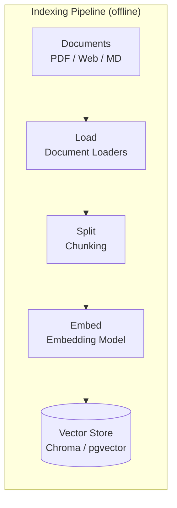

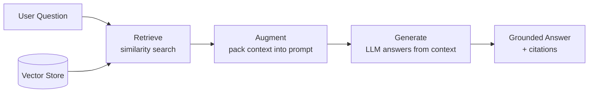

Key mental model: **the indexing pipeline decides what the retriever can find later.** Most RAG failures are ingestion failures that only surface at query time.

---

## 4. Document Loaders

Everything in LangChain retrieval flows through one object — the `Document`:

```python
from langchain_core.documents import Document

doc = Document(
    page_content="This is a sample document.",
    metadata={"source": "manual_creation.txt", "author": "Paulo", "created_at": "2024-06-01"},
)
```

`page_content` is what gets chunked and embedded; `metadata` is what powers filtering, citations, and access control later.

| Loader | Use for | Notes |
|--------|---------|-------|
| `TextLoader` | `.txt` files | One document per file |
| `PyPDFLoader` | PDFs | One document **per page**, page number in metadata |
| `WebBaseLoader` | URLs | Fetches + parses HTML (pair with BeautifulSoup filtering) |
| `DirectoryLoader` | Folders | Glob patterns, recursive bulk loading |

```python
from langchain_community.document_loaders import TextLoader, WebBaseLoader, DirectoryLoader, PyPDFLoader

# PDF -> list of Documents (one per page)
loader = PyPDFLoader("./docs/langchain_demo.pdf")
documents = loader.load()
print(documents[0].metadata)   # {'source': '...', 'page': 0}

# Whole directory, memory-efficient lazy iteration
dir_loader = DirectoryLoader("./data", glob="*.txt", loader_cls=TextLoader)
for doc in dir_loader.lazy_load():   # lazy_load yields one at a time
    print(doc.metadata["source"])
```

> Code: `code/production-rag/core-pipeline/document_loaders.py`
>
> **Rule:** garbage in, garbage out. A PDF parser that scrambles tables into broken text produces poor embeddings — no downstream trick fixes bad parsing.

---

## 5. Indexing Pipeline — Chunking

### Why chunk at all?

- Embedding models have input limits (often ~8K tokens).
- Retrieval precision: short, focused chunks match queries better than whole documents.
- Context budget: you can pack 5 focused chunks into a prompt, not 5 whole PDFs.

### The trade-off (chunk size + overlap)

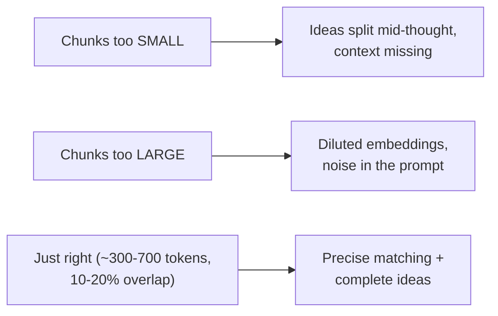

- **Overlap** prevents facts from being cut at boundaries. Too much overlap = storage bloat + duplicate retrieval.
- The course default: `chunk_size=500, chunk_overlap=50` (10%).

### RecursiveCharacterTextSplitter — the workhorse

Splits trying separators in order: paragraphs → lines → sentences → words → characters. Keeps semantic units together as much as possible.

```python
from langchain_text_splitters import RecursiveCharacterTextSplitter

splitter = RecursiveCharacterTextSplitter(
    chunk_size=500,
    chunk_overlap=50,
    separators=["\n\n", "\n", " ", ""],
)
chunks = splitter.split_documents(docs)   # keeps document metadata on each chunk
```

### Structure-aware splitters

```python
# Markdown: split on headings, record the heading path in metadata
from langchain_text_splitters import MarkdownHeaderTextSplitter

splitter = MarkdownHeaderTextSplitter(headers_to_split_on=[("#", "h1"), ("##", "h2"), ("###", "h3")])
chunks = splitter.split_text(md_text)
# each chunk.metadata -> {"h1": "Intro to ML", "h2": "Types of ML"}

# Source code: language-aware splitting that respects functions/classes
from langchain_text_splitters import Language

code_splitter = RecursiveCharacterTextSplitter.from_language(
    language=Language.PYTHON, chunk_size=500, chunk_overlap=50
)
```

> Code: `code/production-rag/core-pipeline/text_splitters.py` — includes `chunk_size_comparison()` (200/500/1000 experiment) and `overlap_importance()`.

**Starting points:** FAQ answers 100–300 tokens · docs 300–700 · policies/manuals 500–1000 · tables keep logical units together.

---

## 6. Embedding Dimensions — Deep Dive

An embedding maps text to a fixed-length vector where **semantic similarity becomes geometric proximity**. "How do I cancel my subscription?" lands near "termination policy" even with zero shared words.

### Model comparison

| Model | Dimensions | Cost / 1M tokens | Best for |
|-------|-----------:|-----------------:|----------|
| `text-embedding-3-small` | 1536 | $0.02 | General use (course default) |
| `text-embedding-3-large` | 3072 | $0.13 | High accuracy |
| `text-embedding-ada-002` | 1536 | $0.10 | Legacy |
| `all-MiniLM-L6-v2` (local, free) | 384 | $0 | Prototyping, privacy |

More dimensions = more expressiveness but more storage/compute. **Critical rule:** query and document embeddings must come from the *same model*. Changing embedding models = full reindex.

### Two methods, two jobs

```python
from langchain_openai import OpenAIEmbeddings
embeddings = OpenAIEmbeddings(model="text-embedding-3-small")

query_vec = embeddings.embed_query("What is Machine Learning?")     # 1 query  -> 1 vector
doc_vecs  = embeddings.embed_documents(["Doc one.", "Doc two."])    # N docs   -> N vectors
```

### Cosine similarity — the ranking math

```python
import numpy as np

def cosine_similarity(v1, v2):
    return np.dot(v1, v2) / (np.linalg.norm(v1) * np.linalg.norm(v2))   # -1 .. 1

ranked = sorted(zip(docs, [cosine_similarity(query_vec, d) for d in doc_vecs]),
                key=lambda x: x[1], reverse=True)
```

### Cache embeddings — never pay twice

```python
from langchain_classic.embeddings.cache import CacheBackedEmbeddings
from langchain_classic.storage import LocalFileStore

store = LocalFileStore(root_path="./embedding_cache/")
cached = CacheBackedEmbeddings.from_bytes_store(
    underlying_embeddings=embeddings, document_embedding_cache=store, namespace="docs"
)
# first call hits the API, identical text afterwards is served from cache
```

> Code: `code/production-rag/core-pipeline/embeddings.py`, `embeddings_deep.py` (basic, batch, similarity ranking, caching)

---

## 7. Hands-on — Create a Vector DB with Chroma

Chroma is the course's development vector database: open-source, runs embedded in your process, persists to disk.

```python
from langchain_chroma import Chroma
from langchain_openai import OpenAIEmbeddings

vectorstore = Chroma.from_documents(
    documents=chunks,                          # split Documents
    embedding=OpenAIEmbeddings(model="text-embedding-3-small"),
    persist_directory="./chroma_db/",          # omit = in-memory
)
print(vectorstore._collection.count())
```

Reload after "restart" — persistence means the index survives:

```python
reloaded = Chroma(embedding_function=embeddings, persist_directory="./chroma_db/")
reloaded.similarity_search("LangChain", k=2)
```

> Full deep dive — architecture, CRUD, filtering, operators — lives in [`04.Vector_Databases/Vector_Databases.md`](../04.Vector_Databases/Vector_Databases.md).

---

## 8. Similarity Search with Scores

Raw `similarity_search` returns documents; scores tell you *how well* they match — essential for debugging retrieval quality and building fallbacks.

```python
# Chroma returns DISTANCE (lower = better). Convert to similarity:
results = vectorstore.similarity_search_with_score("Explain vector stores.", k=3)
for doc, distance in results:
    similarity = 1 / (1 + distance)            # 0..1, higher = better
    print(f"{similarity:.4f} | {doc.page_content[:60]}")
```

### Metadata filtering — narrow the search space first

```python
# semantic search restricted to a metadata subset
vectorstore.similarity_search("What databases are available?", k=5, filter={"topic": "database"})
```

### as_retriever — the interface the rest of the chain consumes

```python
retriever = vectorstore.as_retriever(
    search_type="similarity",       # plain top-k
    search_kwargs={"k": 3},
)

mmr_retriever = vectorstore.as_retriever(
    search_type="mmr",              # Maximal Marginal Relevance:
    search_kwargs={"k": 3, "fetch_k": 20},  # fetch 20, return 3 diverse ones
)
```

**MMR matters when top-k returns near-duplicates** — it penalizes redundancy so 3 slots return 3 *different* relevant docs.

> Code: `code/production-rag/core-pipeline/vector_stores.py` — `similarity_search_with_scores()`, `metadata_filtering()`, `as_retriever()`, `persist_chroma()`

---

## 9. Building a Basic RAG System

The canonical LCEL RAG chain — memorize this shape:

```python
from langchain_core.prompts import ChatPromptTemplate
from langchain_core.runnables import RunnablePassthrough
from langchain_core.output_parsers import StrOutputParser
from langchain.chat_models import init_chat_model

llm = init_chat_model("gpt-4o-mini", temperature=0.2)
retriever = vectorstore.as_retriever(search_kwargs={"k": 2})

prompt = ChatPromptTemplate.from_template("""
Answer the question based only on the following context:

{context}

Question: {question}

Answer concisely. If you don't know, say "I don't know".
""")

def format_docs(docs):
    return "\n\n".join(doc.page_content for doc in docs)

rag_chain = (
    {"context": retriever | format_docs, "question": RunnablePassthrough()}
    | prompt
    | llm
    | StrOutputParser()
)

answer = rag_chain.invoke("What is LangChain?")
```

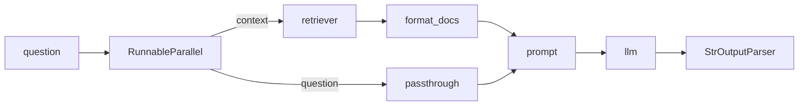

### Three production variations

| Variation | Change | Why |
|-----------|--------|-----|
| **With sources** | Format docs as `[1] source: text`, prompt asks to cite | Trust + debuggability |
| **With fallback** | Prompt: "if not in context, say so" | Kills hallucination on out-of-scope questions |
| **Structured output** | `llm.with_structured_output(RAGResponse)` with Pydantic fields `answer, confidence, sources_used, follow_up` | Machine-readable answers for UIs/agents |

```python
from pydantic import BaseModel, Field
from typing import List

class RAGResponse(BaseModel):
    answer: str = Field(description="The answer to the question")
    confidence: str = Field(description="high, medium, or low")
    sources_used: List[str] = Field(description="List of sources referenced")
    follow_up: str = Field(description="Suggested follow-up question")

structured_llm = llm.with_structured_output(RAGResponse)
```

> Code: `code/production-rag/core-pipeline/rag_pipeline.py` — `demo_basic_rag()`, `demo_rag_with_sources()`, `demo_rag_with_fallback()`, `demo_structured_rag()`

---

## 10. Debugging RAG Systems — The 5 Failure Modes

The course's core diagnostic framework. When answers are bad, classify *where* the pipeline broke before changing anything:

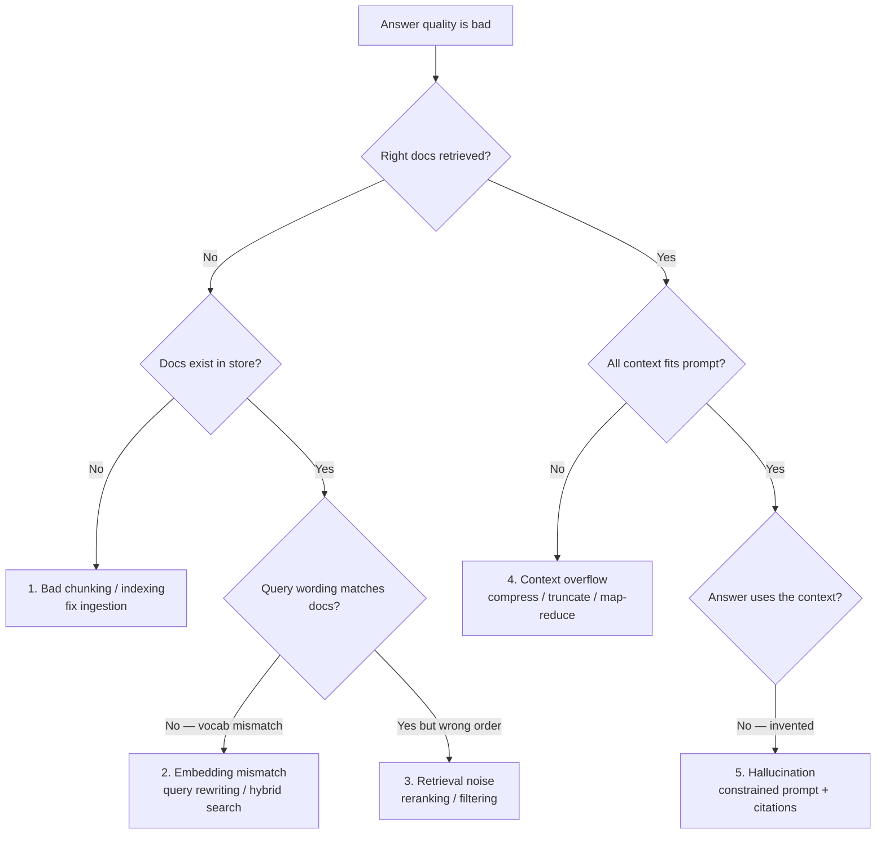

| # | Failure Mode | Symptom | Fix |
|---|--------------|---------|-----|
| 1 | **Bad chunking** | Chunks split mid-sentence; right doc retrieved but wrong part | Semantic/structure-aware splitting, overlap |
| 2 | **Embedding mismatch** | User says "cancel", docs say "termination policy" | Query rewriting, hybrid search |
| 3 | **Retrieval noise** | 10 docs retrieved, 2 relevant | Reranking, metadata filtering, MMR |
| 4 | **Context overflow** | Too much stuffed in prompt; LLM ignores half | Compression, smart truncation |
| 5 | **Hallucination** | Answer not supported by context | "Only from context" prompts, citations, fallback |

**Debug with scores, not vibes:** run a fixed set of ~20 test queries, log retrieved sources + scores per query, and re-run after every change.

---

## 11. Hybrid Search

**Why:** pure semantic search misses *exact terms* — product codes (`ACME-42`), error messages, acronyms, names. Pure keyword search misses synonyms. Hybrid = both, fused.

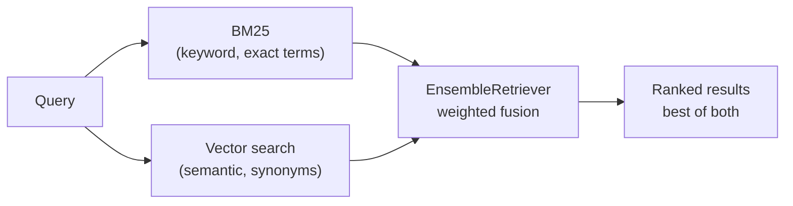

```python
from langchain_community.retrievers import BM25Retriever
from langchain_classic.retrievers import EnsembleRetriever

bm25 = BM25Retriever.from_documents(docs)   # in-memory keyword index
bm25.k = 3

semantic = vectorstore.as_retriever(search_kwargs={"k": 3})

hybrid = EnsembleRetriever(
    retrievers=[bm25, semantic],
    weights=[0.4, 0.6],   # 40% keyword, 60% semantic
)
docs = hybrid.invoke("ACID transactions")   # keyword-heavy query -> BM25 wins
```

Rule of thumb from the course: **keyword-heavy queries → BM25 ranks first; paraphrased/semantic queries → vectors win; hybrid hedges both.** (Fusion uses Reciprocal Rank Fusion under the hood.)

> Code: `code/production-rag/core-pipeline/advanced_rag.py` — `demo_ensemble_hybrid_search()` compares BM25 vs semantic vs ensemble on three query types.

---

## 12. Token Budgeting

Every request pays for input tokens — retrieved context included. Budget it explicitly instead of hoping the prompt stays small:

```python
class TokenBudget:
    def __init__(self, max_tokens_per_request: int = 4000):
        self.max_per_request = max_tokens_per_request
        self.usage = {"total_input": 0, "total_output": 0, "requests": 0}

    def estimate_tokens(self, text: str) -> int:
        return int(len(text.split()) * 1.3)        # rough; use tiktoken in prod

    def check_budget(self, text: str) -> tuple[bool, int]:
        tokens = self.estimate_tokens(text)
        return tokens <= self.max_per_request, tokens

    def record_usage(self, input_tokens: int, output_tokens: int):
        self.usage["total_input"] += input_tokens
        self.usage["total_output"] += output_tokens
        self.usage["requests"] += 1
```

`BudgetedLLM` wraps an LLM: rejects over-budget requests *before* calling the API, records usage after. In production, wire the same idea to `tiktoken` and per-user/per-day quotas.

> Code: `code/production-rag/core-pipeline/cost_optimization.py` — `TokenBudget`, `BudgetedLLM`, `demo_token_budgeting()`

---

## 13. Observability & LangSmith

You cannot debug what you cannot see. LangSmith traces every step of every chain: inputs, outputs, latency, tokens, cost, errors.

**Setup** — env vars do the work for LangChain/LangGraph code:

```text
LANGSMITH_TRACING=true
LANGSMITH_API_KEY=lsv2_...
LANGSMITH_PROJECT=rag-production
```

**`@traceable`** adds your own functions to the same trace tree:

```python
from langsmith import traceable

@traceable(name="routed_query", tags=["production", "rag"])
def invoke(query: str):
    ...

@traceable(name="security_check")
def check(self, user_input: str) -> dict:
    ...
```

What you get in the dashboard:

| Capability | Use |
|------------|-----|
| Full trace trees | See retriever → prompt → LLM nesting with inputs/outputs |
| Latency + token cost per step | Find the expensive/slow step |
| Metadata & tag filtering | `user_id`, `request_type` — find one user's failing traces |
| Dataset evaluation runs | Regression-test prompt or model changes |
| Monitor mode | Error rates, feedback scores over time |

> Code: `code/production-rag/core-pipeline/langsmith_setup.py` — `demo_basic_tracing()`, `demo_named_runs()`, `demo_trace_with_metadata()`

---

## 14. RAG Optimization

Four levers, in the order you should reach for them:

### 14.1 Query transformation (rewrite before retrieving)

User queries are vague ("that thing you told me about"). Fix the *query*, not the index:

- **Multi-Query Retriever** — LLM generates N rephrasings, retrieves for each, unions the results. Catches docs that only match one phrasing.
- **Query rewriting** — expand acronyms, resolve pronouns from chat history.

```python
from langchain_classic.retrievers.multi_query import MultiQueryRetriever

multi_retriever = MultiQueryRetriever.from_llm(
    retriever=vectorstore.as_retriever(search_kwargs={"k": 2}),
    llm=ChatOpenAI(model="gpt-4o-mini", temperature=0.3),
)
# enable INFO logging on "langchain.retrievers.multi_query" to see generated queries
```

### 14.2 Contextual compression (retrieve wide, keep only relevant)

Retrieve `k=4` generously, then an LLM extractor strips each chunk down to the query-relevant sentences — less noise, fewer tokens in the prompt:

```python
from langchain_classic.retrievers import ContextualCompressionRetriever
from langchain_classic.retrievers.document_compressors import LLMChainExtractor

compression_retriever = ContextualCompressionRetriever(
    base_compressor=LLMChainExtractor.from_llm(llm),
    base_retriever=vectorstore.as_retriever(search_kwargs={"k": 4}),
)
```

### 14.3 Parent Document Retriever (small-to-big)

Search on small precise chunks (200 tokens), but **return their large parents** (800 tokens) so the LLM gets full context:

```python
from langchain_classic.retrievers import ParentDocumentRetriever
from langchain_classic.storage import InMemoryStore

retriever = ParentDocumentRetriever(
    vectorstore=vectorstore,
    docstore=InMemoryStore(),                # holds full parent docs
    child_splitter=RecursiveCharacterTextSplitter(chunk_size=200, chunk_overlap=20),
    parent_splitter=RecursiveCharacterTextSplitter(chunk_size=800, chunk_overlap=100),
)
```

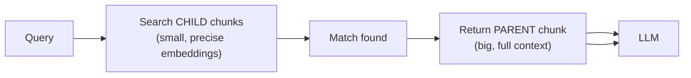

### 14.4 Reranking

Retrieval optimizes for *recall* (fast, approximate); reranking optimizes for *precision* on the top candidates. A **cross-encoder** (e.g., Cohere Rerank, `BGE-reranker`) reads query + document *together* and outputs a relevance score — far more accurate than bi-encoder cosine similarity, but too slow to run over the whole corpus.

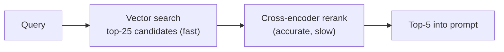

Pattern: retrieve 25 → rerank → keep 5.

### The combined advanced chain

```python
# multi-query (recall) -> compression (precision) -> RAG
advanced_retriever = ContextualCompressionRetriever(
    base_compressor=LLMChainExtractor.from_llm(llm),
    base_retriever=MultiQueryRetriever.from_llm(
        retriever=vectorstore.as_retriever(search_kwargs={"k": 3}), llm=llm),
)
rag_chain = (
    {"context": advanced_retriever | format_docs, "question": RunnablePassthrough()}
    | prompt | llm | StrOutputParser()
)
```

> Code: `code/production-rag/core-pipeline/advanced_rag.py` — all four demos plus `demo_advanced_rag_chain()`

---

## 15. Scaling RAG & The Real Costs of Vector Search

### Model routing — pay for intelligence only when needed

```python
class ModelRouter:
    def __init__(self):
        self.cheap_model = ChatOpenAI(model="gpt-4o-mini")      # ~$0.00015/1K
        self.expensive_model = ChatOpenAI(model="gpt-4o")       # ~$0.0025/1K

    def invoke(self, query):
        complexity = self.classify_complexity(query)            # cheap classifier call
        model = self.cheap_model if complexity == "simple" else self.expensive_model
        return model.invoke(query)
```

### Semantic caching — don't pay for the same answer twice

Normalize the query → hash → serve cached responses for repeats. The production version embeds queries and returns a cache hit when similarity > threshold (~0.95), so "What is Python?" and "what is python?" hit.

```python
class SemanticCache:
    def __init__(self, similarity_threshold: float = 0.9):
        self.cache, self.threshold = {}, similarity_threshold

    def _hash_query(self, query: str) -> str:
        return hashlib.md5(query.lower().strip().encode()).hexdigest()

    def get(self, query): ...   # exact match now, embedding similarity in prod
    def set(self, query, response): ...
```

### The real cost stack (per month, at scale)

| Cost component | Driver | Control |
|----------------|--------|---------|
| Embedding generation | # of chunks at ingestion | Caching, local models for dev |
| Vector storage | dims × vectors | Smaller models, quantization |
| Query embedding + search | traffic | Cache queries |
| LLM input tokens | retrieved context size | Compression, rerank-to-top-5 |
| Reranking calls | if enabled | Rerank only top-k candidates |
| Observability | trace volume | Sample traces in production |

> Code: `code/production-rag/core-pipeline/cost_optimization.py` — `ModelRouter`, `SemanticCache`, `CachedLLM`

---

## 16. Production Hosting — Supabase & pgvector

Chroma is a dev tool. For production the course moves to **PostgreSQL + pgvector**, hosted on **Supabase**:

- **One database** for relational data + vectors + metadata → real joins (`WHERE tenant_id = ...`), transactions, ACID guarantees.
- **No new infrastructure** — backups, auth, and ops you already have.
- **Supabase** = managed Postgres with pgvector preinstalled, plus row-level security for multi-tenant RAG.

```sql
CREATE EXTENSION IF NOT EXISTS vector;

CREATE TABLE documents (
    id BIGSERIAL PRIMARY KEY,
    content TEXT,
    metadata JSONB,
    embedding vector(1536)              -- matches text-embedding-3-small
);

-- cosine similarity search, top 5
SELECT content FROM documents
ORDER BY embedding <=> $1          -- $1 = query embedding
LIMIT 5;
```

Full pgvector deep dive (operators, IVFFlat/HNSW indexes, hybrid SQL search): [`04.Vector_Databases/Vector_Databases.md`](../04.Vector_Databases/Vector_Databases.md#5-pgvector--postgresql-as-a-vector-database).

---

## 17. Three Pillars of Production Visibility

| Pillar | Answers | Implementation |
|--------|---------|----------------|
| **Structured logs** | "What exactly happened in this request?" | JSON logs with request IDs (searchable/aggregatable) |
| **Metrics** | "How is the system trending?" | Latency, token usage, error rates, cache hit rate |
| **Traces** | "Why did this specific answer fail?" | LangSmith trace trees per request |

```python
import logging, json

class JSONFormatter(logging.Formatter):
    def format(self, record):
        log = {"ts": ..., "level": record.levelname, "msg": record.getMessage()}
        return json.dumps(log)          # machine-parseable, not printf strings

class MetricsCollector:
    def record(self, metric, value, tags=None): ...   # latency_ms, tokens, errors
```

Alert thresholds worth having from day one: `p99 latency > 500ms`, `error rate > 1%`, `retrieval score below threshold`.

> Code: `code/production-rag/core-pipeline/monitoring.py` — `JSONFormatter`, `MetricsCollector`, `InstrumentedLLM`

---

## 18. Production Project — Security Layer, FastAPI & LangGraph

The production architecture: **FastAPI** exposes the API → **LangGraph agent** orchestrates retrieve/generate → **LangSmith** observes everything → **security layer** screens input and output.

### The 5-stage secure pipeline

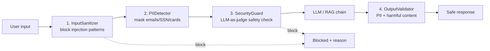

```python
class InputSanitizer:
    INJECTION_PATTERNS = [
        r"ignore\s+(all\s+)?previous\s+instructions",
        r"forget\s+(all\s+)?previous",
        r"system\s*prompt",
        r"pretend\s+you\s+are",
        r"bypass\s+(all\s+)?restrictions",
    ]
    def is_suspicious(self, text) -> tuple[bool, str | None]: ...
    def sanitize(self, text) -> str: ...      # strip delimiters, neutralize {{ }}

class PIIDetector:
    PATTERNS = {"email": r"...", "phone": r"...", "ssn": r"...",
                "credit_card": r"...", "ip_address": r"..."}
    def detect(self, text) -> dict: ...       # {"email": ["john@x.com"]}
    def mask(self, text) -> str: ...          # "[EMAIL REDACTED]"

class SecurityGuard:                          # LLM-as-guard: catches what regex misses
    def check(self, user_input) -> dict:      # {"safe": false, "reason": "..."}
        ...

class SecurePipeline:                         # composes all five stages
    def process(self, user_input: str) -> dict:
        # sanitize -> mask PII -> guard check -> LLM -> validate output
        ...
```

### Security checklist

- [ ] Input sanitization before anything reaches the LLM
- [ ] PII detection/masking on input **and** output
- [ ] LLM guard for semantic attacks regex can't catch
- [ ] Output validation (no secrets, keys, harmful content)
- [ ] Prompt-injection-resistant system prompts
- [ ] Per-tenant metadata filtering at the DB level (row-level security)
- [ ] Rate limiting + token budgets per user
- [ ] Secrets in env vars / secret manager, never in code or traces
- [ ] Security events logged and alerted

> Code: `code/production-rag/core-pipeline/security_patterns.py` — all five classes with demos

---

## 19. Advanced RAG

### 19.1 Long Context Models vs RAG

"Is RAG dead with 1M-token windows?" — No. It's a **cost and latency decision**:

| | Long Context (stuff everything) | RAG (retrieve 4–8 chunks) |
|---|---|---|
| Input per query vs 100K-token docs | ~100,100 tokens (~$0.25) | ~2,100 tokens (~$0.005) — **~50x cheaper** |
| Latency | Grows with context size | Retrieval overhead + small context |
| Accuracy on specific facts | "Lost in the middle" risk | Focused context |
| Citations | Hard | Native (per-chunk metadata) |
| Freshness | Re-send everything each query | Re-index changed docs only |

**Decision framework:**

- **Long context when:** corpus < 50K tokens, low query volume, whole-document analysis needed, docs change constantly.
- **RAG when:** large corpus, high query volume, specific-topic questions, citations required.
- **Hybrid (best of both):** RAG retrieves the right *document* → load the *full document* into context for a deep answer.

```python
# hybrid: retrieve the right doc, then analyze it in full
relevant_docs = vectorstore.as_retriever(search_kwargs={"k": 1}).invoke(query)
full_doc = relevant_docs[0].page_content          # whole policy, not a chunk
response = chain.invoke({"document": full_doc, "query": query})
```

> Code: `code/production-rag/advanced-rag/01_long_context_vs_rag.py` — cost/latency math + `demo_hybrid_approach()`

### 19.2 Contextual Retrieval

**The problem:** chunking strips context. `"The company was founded in 1994"` — *which company?* A user asking "What is ACME's revenue?" won't match a chunk that never says "ACME".

**The fix (Anthropic):** before embedding, ask an LLM to write a 1–2 sentence context prefix situating each chunk within its document. **Result: 67% fewer retrieval failures.**

```python
prompt = """Given the document and this chunk, write a SHORT context (1-2 sentences)
situating the chunk: document title, key entities, disambiguating info. Output only the prefix."""

context_prefix = llm.invoke(...)                    # "This chunk is from ACME Corp's 2025 annual
contextualized = f"{context_prefix} {chunk}"        #  report, discussing fiscal-year revenue..."
# embed + index `contextualized`, keep original chunk for display
```

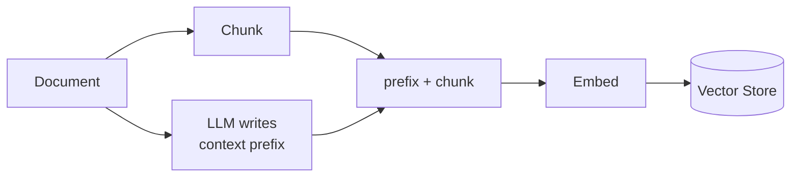

**Production notes:** one-time indexing cost (~$0.01–0.05/document, +1–2s per chunk — batch it offline); chunks ~20–30% bigger; no query-time impact. Use it when chunks reference entities by pronoun or documents come from many sources.

> Code: `code/production-rag/advanced-rag/02_contextual_retrieval.py` — problem demo, `add_contextual_prefix()`, `compare_retrieval()` (scores side-by-side), `create_contextual_chunks()`

### 19.3 Late Chunking vs Early Chunking

**Early (traditional):** split → embed each chunk *independently*. Pronouns get orphaned: chunk 2 says "He co-founded Apple" — embedding of "He" knows nothing about Steve Jobs.

**Late chunking:** embed the *full document* through a long-context embedding model → the model's token-level representations have attended over the whole document → *then* pool token embeddings per chunk position. Every chunk vector "knows" the whole document.

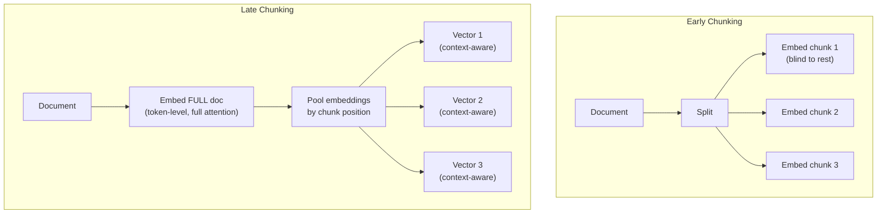

**Implementation options** (true late chunking needs token-level embeddings, e.g. Jina `jina-embeddings-v3` with `late_chunking=True`):

| Approach | Context quality | Cost | Notes |
|----------|----------------|------|-------|
| Early chunking | ★☆☆ | Free | Default |
| Overlapping chunks (10–20%) | ★★☆ | Free | First easy win |
| Contextual Retrieval (19.2) | ★★★ | ~$0.01/doc | Works with any embedder |
| Late chunking (Jina) | ★★★ | Special model | +10–12% retrieval accuracy |
| Parent-Child retriever (14.3) | ★★★ | 2x storage | Fixes context at return-time, not embedding-time |

Combined approaches: +25–30% over naive chunking.

> Code: `code/production-rag/advanced-rag/03_late_chunking.py` — pronoun-orphan demo, similarity comparison, all four options

### 19.4 Agentic RAG — Self-Correcting Retrieval

Traditional RAG is one-shot: retrieve → generate, and *hope*. Agentic RAG adds an evaluation loop — the system **grades its own retrieval and retries** with a rewritten query:

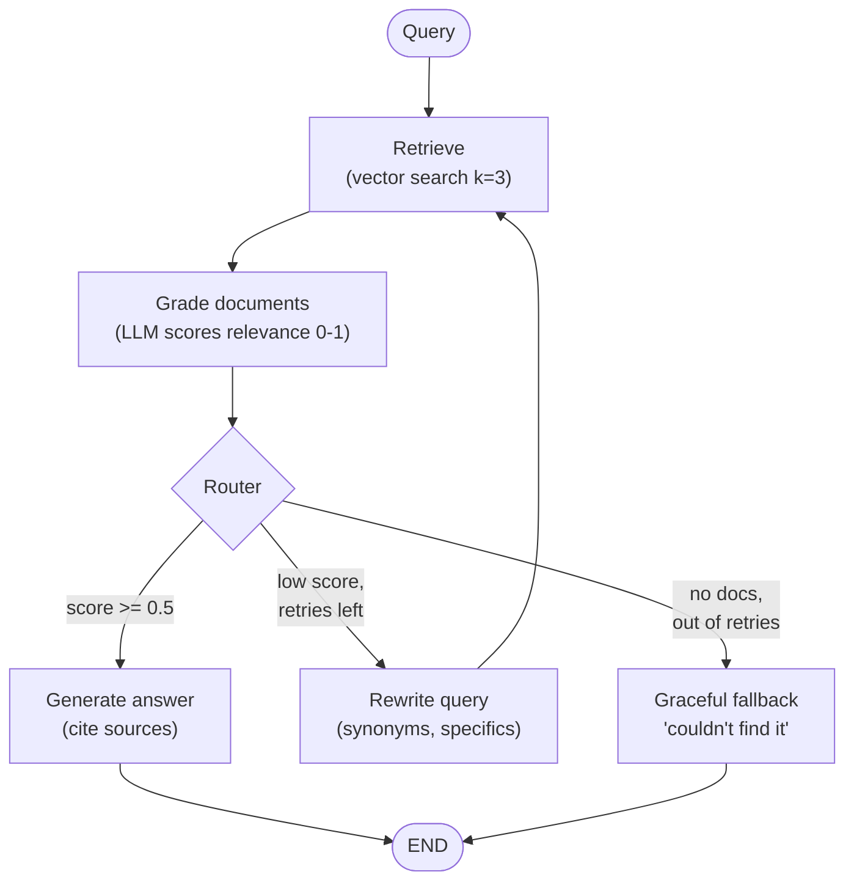

State machine (LangGraph `StateGraph`), not a chain — the cycle `rewrite → retrieve → grade` is what makes it *agentic*:

```python
from langgraph.graph import StateGraph, END

class RAGState(TypedDict):
    query: str
    rewritten_query: str
    documents: list[Document]
    generation: str
    relevance_score: float
    retry_count: int
    max_retries: int

workflow = StateGraph(RAGState)
workflow.add_node("retrieve", retrieve_documents)
workflow.add_node("grade", grade_documents)      # LLM scores each doc 0-1
workflow.add_node("rewrite", rewrite_query)
workflow.add_node("generate", generate_answer)
workflow.add_node("fallback", generate_fallback)

workflow.set_entry_point("retrieve")
workflow.add_edge("retrieve", "grade")
workflow.add_conditional_edges("grade", should_retry_or_generate,
                               {"rewrite": "rewrite", "generate": "generate", "fallback": "fallback"})
workflow.add_edge("rewrite", "retrieve")         # the self-correction loop
workflow.add_edge("generate", END)
workflow.add_edge("fallback", END)
app = workflow.compile()
```

**Use when:** queries may need reformulation, answer quality is high-stakes, document types are diverse. **Cost:** each retry = extra LLM grading + rewrite calls — cap `max_retries` at 2.

> Code: `code/production-rag/advanced-rag/04_agentic_rag.py` — full working graph

### 19.5 GraphRAG — Multi-hop Reasoning

Vector similarity can't traverse relationships. *"Who works in the same department as the CEO's assistant?"* requires: CEO → assistant → department → coworkers. No single chunk contains that answer.

**GraphRAG** builds a knowledge graph from documents — **entities as nodes, relationships as edges** — then *traverses* it:

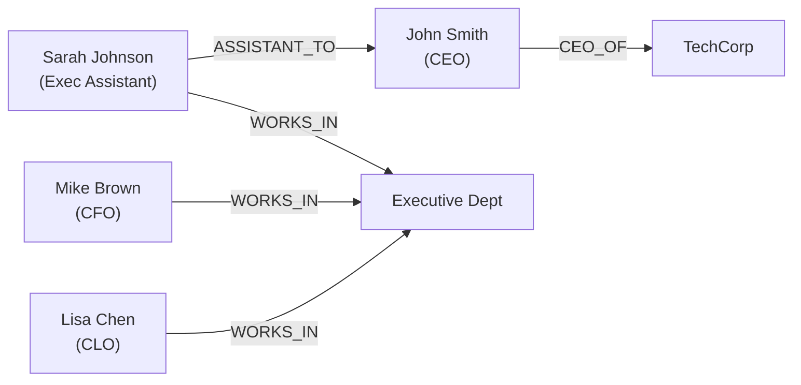

```python
import networkx as nx

G = nx.DiGraph()
G.add_node("Sarah Johnson", type="Person", role="Executive Assistant")
G.add_edge("Sarah Johnson", "John Smith", relation="ASSISTANT_TO")
G.add_edge("Sarah Johnson", "Executive Department", relation="WORKS_IN")
# traversal: find CEO -> find ASSISTANT_TO edge -> find WORKS_IN edge -> siblings
```

**Indexing phase:** LLM extracts entities + relationships from every chunk → builds graph → detects communities → LLM summarizes each community.
**Query phase, two modes:**
- **Local search** — identify entities in the query, traverse edges (multi-hop questions).
- **Global search** — use community summaries for "what are the main themes?" questions.

**Implementation options:** Microsoft GraphRAG (`pip install graphrag` — full-featured, expensive indexing) · LangChain + Neo4j (`GraphCypherQAChain`) · LlamaIndex `KnowledgeGraphIndex` · hybrid vector+graph.

**Use when** documents describe relationships (org charts, research citations) and multi-hop questions are expected. **Skip for** simple fact retrieval, small corpora, or tight budgets.

> Code: `code/production-rag/advanced-rag/05_graphrag_intro.py` — graph build, traversal, LLM entity extraction

### 19.6 Multimodal RAG — ColPali (Vision-Based Document RAG)

**The problem:** text extraction is *lossy*. Tables become jumbled character streams, charts lose all meaning, diagrams vanish:

```text
PDF table:  Region | Target | Actual | Var      Extracted text:
            North | $2.5M  | $2.8M  | +12%     "Region Q1 Target Q1 Actual Variance
            South | $1.8M  | $1.5M  | -17%      North $2.5M $2.8M +12% South $1.8M..."
            → which number belongs to which region? gone.
```

**ColPali's insight:** stop extracting text. Convert each PDF page to an **image**, embed the *images* directly (ColPali = late-interaction embeddings over PaliGemma capturing text + layout + visuals), and retrieve **page images**. A vision LLM (GPT-4o, Claude) then *sees* the actual table.

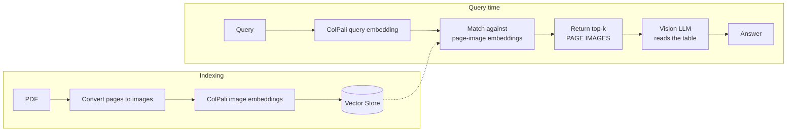

| | Text RAG | ColPali Multimodal RAG |
|---|---|---|
| Indexing | ~$0.0001/page | ~$0.001/page (needs GPU) |
| Query | ~$0.01 (gpt-4o-mini) | ~$0.10 (vision model) |
| Tables/charts/diagrams | Destroyed | Fully preserved |
| Best for | Plain text docs | Financial reports, technical diagrams, scientific papers |

> Code: `code/production-rag/advanced-rag/06_multimodal_rag.py` — extraction-failure demo + full ColPali pipeline implementation

---

## 20. Summary — RAG Evolution & Current State

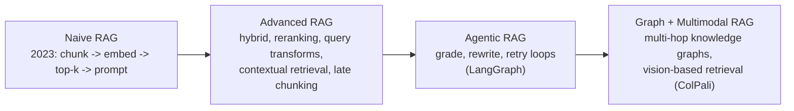

| Question | Answer |
|----------|--------|
| Small corpus, low traffic? | Long context — skip RAG |
| Default production setup? | Contextual retrieval + hybrid search + reranking + structured output |
| Queries failing on vocab mismatch? | Hybrid + query rewriting |
| Multi-hop "connected to X" questions? | GraphRAG |
| Tables/charts in PDFs? | ColPali multimodal RAG |
| Can't trust one-shot retrieval? | Agentic RAG loop |
| Production stack? | FastAPI + LangGraph + pgvector/Supabase + LangSmith + security pipeline |

---

## 21. LlamaIndex — The RAG-First Framework

LlamaIndex exists *for* RAG: documents are first-class citizens, not an add-on.

| | LlamaIndex | LangChain |
|---|---|---|
| Philosophy | Data framework: ingest → index → query | General LLM toolbox: chains, agents, integrations |
| RAG ergonomics | Minimal: `VectorStoreIndex.from_documents(docs)` then `query_engine.query(q)` | More assembly: retriever + prompt + chain |
| Custom pipelines | Node postprocessors, retriever customization | LCEL composability |
| Agents | Secondary (LlamaAgents) | First-class (LangGraph) |
| Pick it when | RAG is the whole product; fastest path to quality retrieval | You need agents, complex orchestration, or deep LangSmith/LangGraph integration |

Concepts transfer 1:1 (loaders → `Reader`s, splitters → `NodeParser`s, retrievers, rerankers, response synthesizers) — learning both makes you framework-independent.

---

## 22. Study Checklist

- [ ] I can draw both RAG pipelines from memory (indexing + query)
- [ ] I can explain chunk size/overlap trade-offs and pick a strategy per document type
- [ ] I know why query and document embeddings must share one model
- [ ] I can build the basic LCEL RAG chain plus sources/fallback/structured variants
- [ ] I can diagnose failures using the 5 failure modes framework
- [ ] I can explain why hybrid search beats either method alone, and configure EnsembleRetriever weights
- [ ] I can add multi-query + compression + parent-document retrieval and say what each fixes
- [ ] I can set up LangSmith tracing and read a trace tree
- [ ] I understand model routing, semantic caching, and token budgeting
- [ ] I can articulate the long-context-vs-RAG decision and the hybrid approach
- [ ] I can implement contextual retrieval and explain the 67% stat
- [ ] I can explain early vs late chunking with the pronoun-orphan example
- [ ] I can build an agentic RAG graph (retrieve → grade → rewrite → generate) in LangGraph
- [ ] I can explain when GraphRAG beats vector search, and local vs global search
- [ ] I can explain what ColPali fixes and its cost trade-off
- [ ] I can list the 5 stages of the security pipeline

## 23. Source Trail

- Course repos: [`code/production-rag/core-pipeline/`](code/production-rag/core-pipeline/) · [`code/production-rag/advanced-rag/`](code/production-rag/advanced-rag/)
- Original RAG paper: <https://arxiv.org/abs/2005.11401>
- Anthropic contextual retrieval: <https://www.anthropic.com/engineering/contextual-retrieval>
- Jina late chunking: <https://jina.ai/news/late-chunking-in-long-context-embedding-models/>
- Microsoft GraphRAG: <https://microsoft.github.io/graphrag/>
- ColPali paper: <https://arxiv.org/abs/2407.01449>
- LangChain retrieval docs: <https://docs.langchain.com/oss/python/deepagents/retrieval>
- LangSmith observability: <https://docs.langchain.com/langsmith/observability-concepts>
- Companion notes: [`04.Vector_Databases/Vector_Databases.md`](../04.Vector_Databases/Vector_Databases.md) · [`07.LangChain_Ecosystem/`](../07.LangChain_Ecosystem/)
