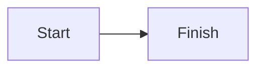
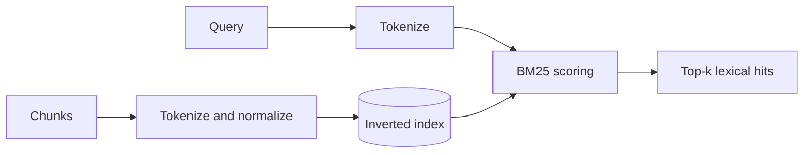
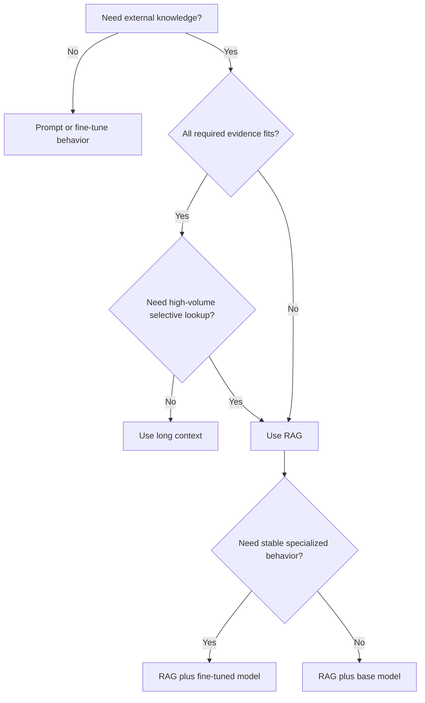
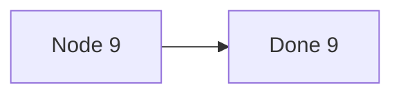
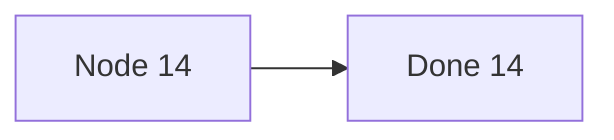
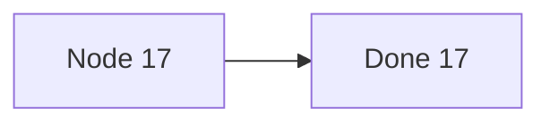

# TEMPORARY Mermaid probe (will be deleted after diagnosis)

## P1 trivial



## P2 copy of 11.1 diagram



## P3 copy of chapter 3 diagram



## P4 bulk trivial diagrams










```mermaid
flowchart LR
    X18[Node 18] --> Y18[Done 18]
```

```mermaid
flowchart LR
    X19[Node 19] --> Y19[Done 19]
```

```mermaid
flowchart LR
    X20[Node 20] --> Y20[Done 20]
```

## P5 copy of 27.1 diagram

```mermaid
flowchart TD
    B[Bad answer] --> S{Correct source exists and is authorized?}
    S -->|No| C[Fix corpus/scope or abstain]
    S -->|Yes| I{Correctly parsed and indexed?}
    I -->|No| P[Fix ingestion and re-index]
    I -->|Yes| R{In candidate set?}
    R -->|No| Q[Fix query/search/filter/ANN recall]
    R -->|Yes| K{Survived rerank and packing?}
    K -->|No| X[Fix rerank/dedupe/token budget]
    K -->|Yes| G{Answer supported?}
    G -->|No| V[Fix prompt/model/validation]
    G -->|Yes| U[Check UI, citation rendering, user expectation]
```
