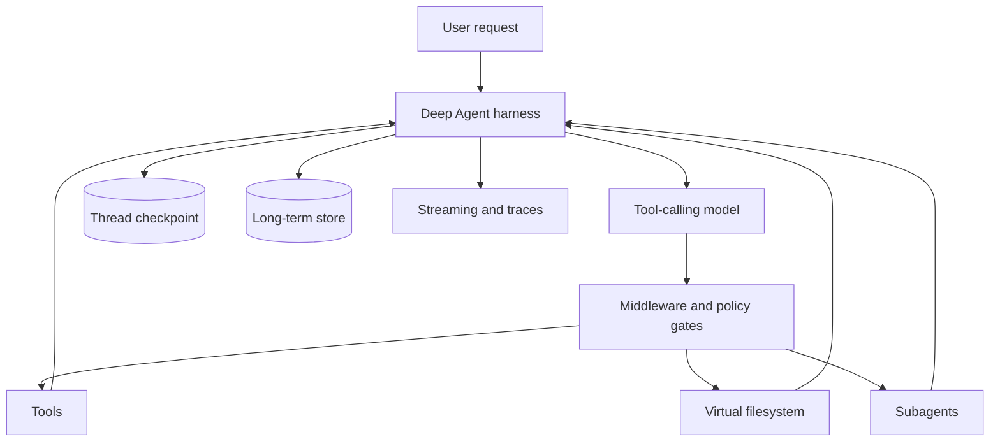
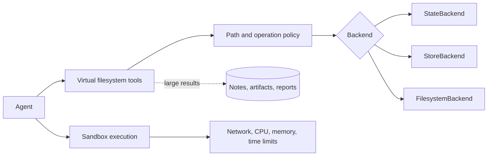
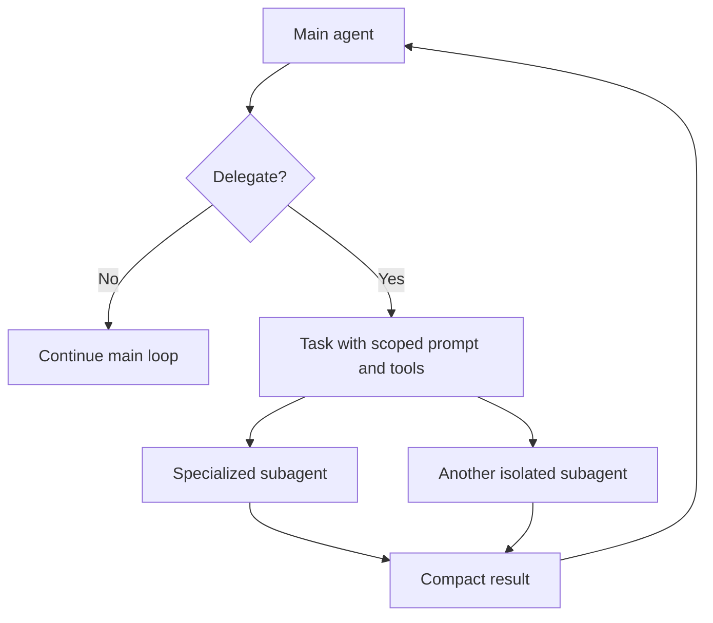
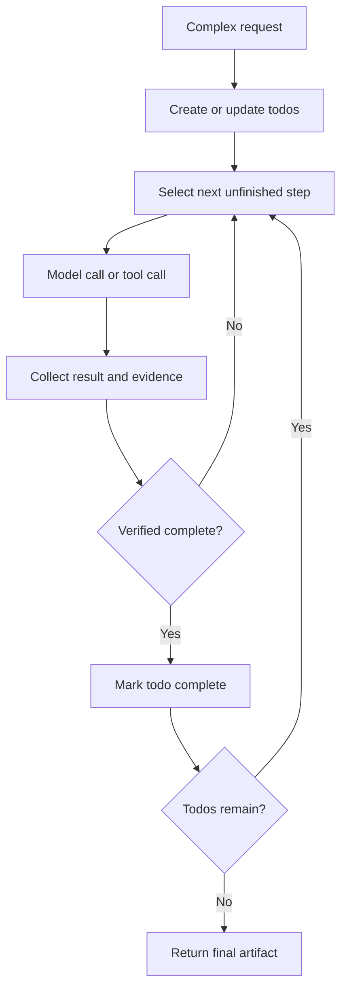
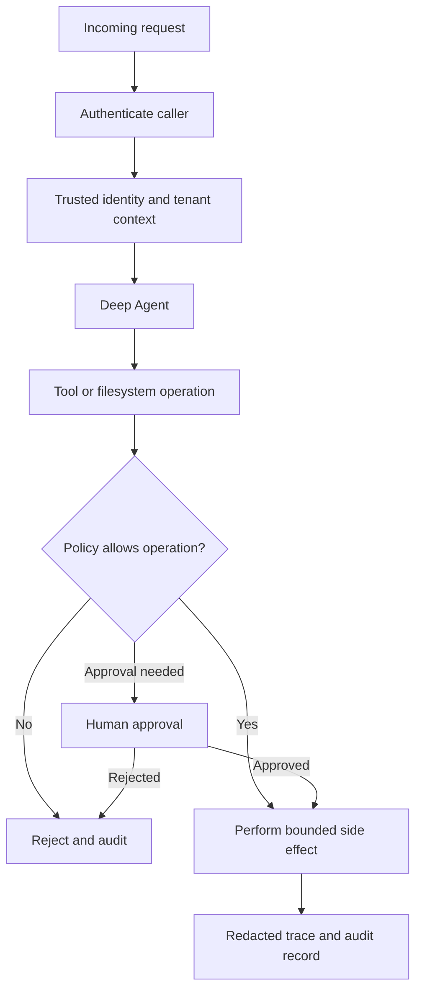
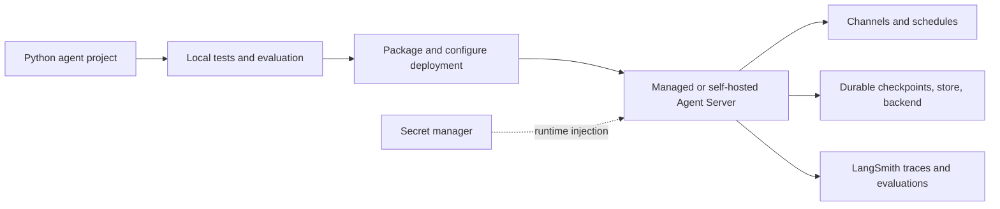

# Deep Agents in Python: A Practical Handbook

This handbook is a Python-first guide to the current [LangChain Deep Agents documentation](https://docs.langchain.com/oss/python/deepagents/overview). It focuses on the `deepagents` SDK and the LangGraph runtime beneath it. Examples use placeholders only: never put a real API key in source control.

## 1. What Deep Agents Are

An ordinary tool-calling agent is often enough for a short request. A **Deep Agent** is a prebuilt harness for complex, long-running work: it can plan, use tools, write intermediate artifacts to a virtual filesystem, delegate isolated work to subagents, summarize context, and resume from durable state. The [architecture overview](https://docs.langchain.com/oss/python/deepagents/overview) describes it as an opinionated layer over LangGraph and LangChain.

Choose the smallest abstraction that fits:

| Need | Start with |
| --- | --- |
| A model and a few tools | [LangChain `create_agent`](https://docs.langchain.com/oss/python/langchain/agents) |
| Durable, explicit state-machine orchestration | [LangGraph](https://docs.langchain.com/oss/python/langgraph/overview) |
| Planning, files, delegation, and long horizons | [Deep Agents](https://docs.langchain.com/oss/python/deepagents/overview) |
| A hosted, code-first Deep Agent runtime | [Managed Deep Agents](https://docs.langchain.com/langsmith/python/managed-deep-agents-overview) |
| An interactive terminal coding agent | [Deep Agents Code](https://docs.langchain.com/oss/deepagents/code/overview) |

Deep Agents are not autonomous by default in the security sense. They only have the tools, backend, identity, permissions, and model capabilities you provide.

## 2. Architecture and Execution Loop

At a high level:

```text
user input
   |
   v
LangGraph state + checkpointer
   |
   v
middleware -> model -> tool calls/files/subagents -> middleware
                    |                  |
                    +---- repeat ------+
   |
   v
final response / interrupt / streamed events
```

The harness normally combines:

- A chat model that decides the next action.
- Model-visible application tools and built-in filesystem tools.
- A backend that stores virtual files and artifacts.
- Optional skills, memory, planning, summarization, subagents, and sandbox execution.
- Middleware around model calls, tool calls, and lifecycle events.
- LangGraph checkpoints for threads, pause/resume, and durable execution.

The important context distinction is:

- **Thread state**: conversation and run-local state, persisted by a checkpointer.
- **Long-term memory**: cross-thread facts in a LangGraph `Store`.
- **Filesystem context**: large intermediate data offloaded from model messages.
- **Skills**: task-specific instructions loaded progressively.
- **Runtime context**: trusted application data such as the authenticated user, tenant, or request metadata.



## 3. `create_deep_agent`

The primary entry point is [`create_deep_agent`](https://reference.langchain.com/python/deepagents/factory/create_deep_agent). A minimal configuration is:

```python
from deepagents import create_deep_agent

agent = create_deep_agent(
    model="provider:model-name",
    system_prompt="You are a careful research assistant.",
    tools=[],
)
```

The commonly used options are:

| Option | Purpose |
| --- | --- |
| `model` | A provider/model string or a configured chat model object. See [models](https://docs.langchain.com/oss/python/deepagents/models). |
| `system_prompt` | Always-on behavior and boundaries. |
| `tools` | Python callables, LangChain tools, or MCP-loaded tools. |
| `skills` | Virtual directories containing `SKILL.md` files. |
| `backend` | Filesystem implementation for reads, writes, edits, searches, and artifacts. |
| `store` | Long-term LangGraph store, needed by features that persist across threads. |
| `checkpointer` | Thread checkpoints; required for reliable interrupts and resume. |
| `subagents` | Static subagent specifications exposed to the main agent. |
| `middleware` | Custom or built-in behavior around the loop. |
| `interrupt_on` | Pause before selected tools for review. |
| `permissions` | Path/operation policy for filesystem tools. |

Inspect the [Python reference](https://docs.langchain.com/oss/python/reference/deepagents-python) and the installed package version before relying on less common parameters.

## 4. Models

Deep Agents needs a tool-calling chat model with a context window appropriate for the task. The [model guide](https://docs.langchain.com/oss/python/deepagents/models) covers provider strings and model configuration. Provider packages are installed separately, for example `langchain-anthropic`, `langchain-openai`, or `langchain-google-genai`.

Prefer a configured object when you need temperature, timeouts, structured output, callbacks, or fallbacks:

```python
import os
from langchain.chat_models import init_chat_model

model = init_chat_model(
    os.environ.get("DEEPAGENTS_MODEL", "openai:gpt-4.1-mini"),
    temperature=0,
    timeout=60,
    max_retries=2,
)
```

Model selection is an engineering tradeoff:

- Use a strong model for planning, ambiguous tool selection, code changes, and synthesis.
- Use a cheaper or faster model for simple subagent work when quality is acceptable.
- Confirm that every selected model supports the tool schema and content types you send.
- Treat provider names, model IDs, token limits, and feature support as version-sensitive.
- Use [model fallback middleware](https://docs.langchain.com/oss/python/deepagents/fault-tolerance) for provider outages rather than silently returning partial work.

## 5. Instructions and Context Engineering

The system prompt should define the agent's role, success criteria, source-of-truth rules, tool boundaries, escalation policy, and output contract. Keep stable policy in `system_prompt`; put task-specific procedures in skills; put user-specific facts in memory or runtime context.

Good instructions are explicit about:

1. What the agent must accomplish and how completion is verified.
2. Which tools are authoritative and which sources are untrusted data.
3. When it must ask a human instead of guessing or taking an irreversible action.
4. How to cite evidence and report uncertainty.
5. Where to write large intermediate results and what final artifact to return.

The [context-engineering guide](https://docs.langchain.com/oss/python/deepagents/context-engineering) recommends offloading large content to the filesystem, loading knowledge progressively, isolating subagent context, and summarizing before the context window overflows. This is usually better than repeatedly copying full documents into messages.

## 6. Tools

Tools are the controlled boundary between model decisions and application effects. Define narrow, typed, validated operations with useful docstrings. The [Deep Agents tools guide](https://docs.langchain.com/oss/python/deepagents/tools) lists built-in harness tools and custom tool patterns.

```python
from langchain.tools import tool

@tool
def lookup_order(order_id: str) -> str:
    """Look up a read-only order by its public order ID."""
    if not order_id.startswith("order_"):
        return "Invalid order ID format."
    # Replace with an authenticated service call.
    return f"Placeholder result for {order_id}"
```

Tool design rules:

- Validate arguments at the boundary and enforce authorization in the tool, not only in the prompt.
- Return compact, structured results; put large results in a backend file.
- Make read and write operations separate so permissions and HITL can differ.
- Use idempotency keys for external writes and include audit metadata.
- Never expose raw credentials to the model. Resolve secrets in trusted application code.
- Treat retrieved text and tool output as untrusted content that may contain prompt injection.

## 7. Skills

Skills are progressive-disclosure playbooks. A skill is normally a directory containing a `SKILL.md` with front matter (`name`, `description`) and instructions, plus optional reference files and scripts. The agent sees enough metadata to decide whether to load it, instead of paying the context cost for every skill on every turn. See [Skills](https://docs.langchain.com/oss/python/deepagents/skills).

Example:

```text
skills/
  incident-report/
    SKILL.md
    template.md
    scripts/validate.py
```

```markdown
---
name: incident-report
description: Create a factual incident report with evidence and a timeline.
---

# Incident report

Use this skill for incident investigations. Gather evidence first, write large
notes to `/work/`, and never state an unverified cause as fact.
```

Pass the virtual directory with `skills=["/skills/"]`. Skill scripts can be read from any backend, but execution requires a shell-capable [sandbox backend](https://docs.langchain.com/oss/python/deepagents/sandboxes). If skills live in a store and execution happens in a remote sandbox, synchronize them with custom middleware as described in [sandbox scripts](https://docs.langchain.com/oss/python/deepagents/skills#sandbox-scripts).

## 8. MCP

The [Model Context Protocol integration](https://docs.langchain.com/oss/python/langchain/mcp) standardizes connections to external tool servers. Deep Agents can receive MCP tools through `tools=`. Install the extra with `pip install "langchain[mcp]"`.

```python
import asyncio
from deepagents import create_deep_agent
from langchain.mcp import MCPAdapter

async def main() -> None:
    config = {
        "mcpServers": {
            "internal_docs": {
                "url": "https://placeholder.example/mcp",
                # Add auth through your secret manager, not this file.
            }
        }
    }
    async with MCPAdapter(config) as adapter:
        tools = await adapter.list_tools()
        agent = create_deep_agent(
            model="provider:model-name",
            tools=tools,
        )
        await agent.ainvoke({"messages": [{"role": "user", "content": "Search the docs."}]})

if __name__ == "__main__":
    asyncio.run(main())
```

Use tool filtering, OAuth, transport configuration, timeouts, and server allowlists in production. An MCP server is code execution and data access: review its tools, scope credentials, and log calls. Managed Deep Agents can declare remote connectors in the Python project layout; see [MCP connectors](https://docs.langchain.com/langsmith/python/managed-deep-agents-overview#mcp-connectors).

## 9. Middleware

Middleware is the compositional extension point around model calls, tool calls, and lifecycle hooks. It is suitable for logging, dynamic prompts, redaction, retries, rate limits, guardrails, context injection, and policy enforcement. See [custom middleware](https://docs.langchain.com/oss/python/langchain/middleware/custom) and the [middleware catalog](https://docs.langchain.com/oss/python/langchain/middleware/built-in).

Keep middleware small and ordered deliberately. A security check should run before the side effect; tracing should surround the operation; summarization should occur before the model exceeds its budget. Prefer built-in middleware where it matches the requirement, and test custom middleware with both sync and async execution.

Typical capabilities include:

- Summarization and prompt caching for context pressure.
- Memory and skills loading.
- Model/tool retries, fallbacks, and call limits.
- PII or content checks.
- Human approval and policy gates.
- Dynamic tool selection and runtime prompt changes.

## 10. Memory, Checkpoints, and Backends

Short-term memory is thread state persisted by a checkpointer. Long-term memory is a LangGraph store shared across threads. The [memory guide](https://docs.langchain.com/oss/python/deepagents/memory) explains how to provide a store and how memories can be seeded or updated.

Backends implement the virtual filesystem. The [backend guide](https://docs.langchain.com/oss/python/deepagents/backends) covers:

| Backend | Lifetime and use |
| --- | --- |
| `StateBackend` | Files in current agent state/thread; useful for small, ephemeral work. |
| `StoreBackend` | Files in a LangGraph store; useful for cross-thread durable content. |
| `FilesystemBackend` | Files under a configured local root; useful for local development and controlled workspaces. |
| `CompositeBackend` | Routes path prefixes to different backends, such as durable skills plus an ephemeral workspace. |

Virtual paths use POSIX-style `/` paths even on Windows. Avoid path traversal, route sensitive prefixes explicitly, and enforce quotas. A checkpointer is required for pause/resume and is strongly recommended for every long-running agent.

## 11. Sandboxes and Filesystem Work

The filesystem lets the agent maintain working notes, source files, reports, and large retrieval results without bloating the conversation. A sandbox adds isolated shell/code execution. The [sandbox guide](https://docs.langchain.com/oss/python/deepagents/sandboxes) covers providers and the boundary between the backend and execution environment.

Use a sandbox when the agent must run generated code, install controlled dependencies, inspect a repository, or execute skill scripts. Do not treat isolation as authorization: configure network egress, CPU/memory/time limits, mounted paths, package policy, and secret injection separately. A local filesystem backend is not a security sandbox.



## 12. Subagents and Dynamic Subagents

Subagents isolate context and specialize work. Static specifications are declared at construction time:

```python
agent = create_deep_agent(
    model="provider:model-name",
    subagents=[
        {
            "name": "researcher",
            "description": "Find and summarize relevant evidence.",
            "system_prompt": "Research only. Return sources and concise findings.",
            "tools": [lookup_order],
        }
    ],
)
```

The main agent delegates through the built-in task mechanism; the subagent returns a result rather than sharing the entire parent transcript. This controls context and lets specialized prompts/tools be narrower. See [subagents](https://docs.langchain.com/oss/python/deepagents/subagents), [async subagents](https://docs.langchain.com/oss/python/deepagents/async-subagents), and [dynamic subagents](https://docs.langchain.com/oss/python/deepagents/dynamic-subagents).

Use dynamic subagents when the roster, prompt, model, or tools depend on runtime state. Propagate trusted runtime context explicitly, and never let untrusted user text silently expand permissions. Delegation adds model calls and latency, so use it for isolation, parallelism, or specialization rather than every small task.



## 13. Planning and Todos

Planning is an opt-in capability in current releases. Add the documented todo middleware when a task is long, multi-step, or benefits from visible progress. See [task planning](https://docs.langchain.com/oss/python/deepagents/overview#task-planning) and [todo list middleware](https://docs.langchain.com/oss/python/langchain/middleware/built-in#to-do-list).

Plans are execution aids, not authorization. Validate completion with evidence, do not mark a task complete merely because a tool returned, and cap the number of model/tool calls. For deterministic workflows, use an explicit LangGraph graph rather than asking a model to invent the entire control flow.



## 14. Permissions and Identity

The [permissions guide](https://docs.langchain.com/oss/python/deepagents/permissions) describes filesystem path rules and operation modes. Use default-deny policies for sensitive directories, separate read/write/delete permissions, and `mode="interrupt"` where a person must approve a matched operation. Filesystem permission interrupts require a checkpointer; see [filesystem HITL](https://docs.langchain.com/oss/python/deepagents/human-in-the-loop#filesystem-permission-interrupts).

Identity is an application concern. Resolve the caller before the agent runs, then pass trusted identity and tenant information in runtime context. Every tool and backend access must enforce that identity. Do not use a user-provided name or thread ID as proof of identity. For hosted projects, see [Managed Deep Agents identity](https://docs.langchain.com/langsmith/python/managed-deep-agents-identity) and [connections](https://docs.langchain.com/langsmith/python/managed-deep-agents-connections).



## 15. Channels and Schedules

Channels connect messaging systems to agent runs; schedules start recurring runs. These are primarily Managed Deep Agents project capabilities, not extra arguments that magically make a local SDK process receive Slack messages. Read [channels](https://docs.langchain.com/langsmith/python/managed-deep-agents-channels), [Slack channels](https://docs.langchain.com/langsmith/python/managed-deep-agents-channels-slack), and [schedules](https://docs.langchain.com/langsmith/python/managed-deep-agents-schedules).

Design channel runs with per-user identity, deduplication of webhook events, bounded response sizes, explicit thread mapping, and HITL behavior appropriate for the channel. Schedule jobs should be idempotent, observable, and safe to retry.

## 16. Retrieval and RAG

Deep Agents can perform agentic RAG simply by having a retrieval tool. For a predictable pipeline, retrieve first and then generate; for research, let the agent decide when to retrieve. The [retrieval guide](https://docs.langchain.com/oss/python/deepagents/retrieval) compares 2-step, agentic, and hybrid RAG. The [RAG tutorial](https://docs.langchain.com/oss/python/deepagents/rag) demonstrates retrieval, filesystem offloading, parallel subagent analysis, and citations.

Indexing usually means load documents, split them, embed chunks, and store them in a vector store. At query time:

1. Validate and normalize the query.
2. Retrieve a bounded set of relevant chunks with source metadata.
3. Preserve provenance, timestamps, permissions, and document IDs.
4. Ask the model to distinguish evidence from inference and cite sources.
5. Optionally use a rubric/grader subagent to check grounding.

Retrieval is not a trust boundary. Defend against poisoned documents, cross-tenant leakage, stale indexes, and prompt injection in retrieved text.

## 17. Multimodal Inputs and Outputs

Models may accept images, audio, video, and documents as provider-specific content blocks. The [multimodal guide](https://docs.langchain.com/oss/python/deepagents/multimodal) covers message content and multimodal tool outputs. Check the chosen provider's limits and content-block format before shipping.

Keep binary data out of ordinary text prompts when possible: store it in controlled object storage or a backend, pass a signed/authorized reference, and give tools the minimum access needed. Validate MIME type and size. Do not assume every subagent or model supports the same modality.

## 18. Human-in-the-Loop

Use HITL for consequential actions such as sending messages, changing records, deploying code, deleting files, or spending money. Configure `interrupt_on` for tools or use permission rules with `mode="interrupt"`. The [HITL guide](https://docs.langchain.com/oss/python/deepagents/human-in-the-loop) explains approval, edit, reject, and resume semantics.

```python
from langgraph.checkpoint.memory import InMemorySaver

agent = create_deep_agent(
    model="provider:model-name",
    tools=[send_email],
    interrupt_on={"send_email": True},
    checkpointer=InMemorySaver(),
)
```

Run with a stable `thread_id`, inspect the interrupt, then resume with a `Command` containing the human decision. An approval UI must show the exact tool name and arguments. Never approve based only on a natural-language summary.

## 19. Streaming

Use `invoke` for a final result and `stream`/`astream` for progress. Deep Agents rely on LangGraph streaming. For subagent events, enable subgraph streaming as shown in the [streaming guide](https://docs.langchain.com/oss/python/deepagents/streaming#enable-subgraph-streaming):

```python
for chunk in agent.stream(
    {"messages": [{"role": "user", "content": "Research the topic."}]},
    stream_mode="updates",
    subgraphs=True,
    version="v2",
):
    if chunk["type"] == "updates":
        source = chunk["ns"] or ("main",)
        print(source, chunk["data"])
```

For token UIs, use message/token streaming; for progress UIs, use updates/custom events. Preserve namespaces so users can distinguish parent and subagent activity. See [event streaming](https://docs.langchain.com/oss/python/deepagents/event-streaming) and [frontend subagent streaming](https://docs.langchain.com/oss/python/deepagents/frontend/subagent-streaming).

## 20. Frontends, Deep Agents Code, and Managed Agents

The [frontend overview](https://docs.langchain.com/oss/python/deepagents/frontend/overview) describes connecting a Python agent to a UI. Common choices include a LangGraph/Agent Server client, AG-UI, CopilotKit, or a custom streaming endpoint. The frontend should render messages, tool progress, todos, files/artifacts, subagent namespaces, errors, and interrupts without exposing hidden chain-of-thought.

[Deep Agents Code](https://docs.langchain.com/oss/deepagents/code/overview) is an open-source terminal coding agent built on the SDK. It is useful as a reference implementation and a ready-made coding experience, but it is not a substitute for defining your production application's authorization and data boundaries.

[Managed Deep Agents](https://docs.langchain.com/langsmith/python/managed-deep-agents-overview) is a hosted, code-first LangSmith product. Its project convention separates Python agent configuration, `instructions.md`, `skills/`, `tools/`, `middleware/`, sandbox, memory, identity, channels, schedules, and evals. Deployment compiles the project to a managed LangGraph app and provides an Agent Server API and MCP endpoint. Current docs label it public beta and US-region-only, so verify availability before committing to it.



## 21. Fault Tolerance

Different failures need different responses. The [fault-tolerance guide](https://docs.langchain.com/oss/python/deepagents/fault-tolerance) recommends:

| Failure | Response |
| --- | --- |
| Timeout/rate limit | Retry with bounded exponential backoff. |
| Provider outage | Fall back to a compatible model. |
| Bad tool input/output | Return a structured error so the model can correct it. |
| Runaway loop | Cap model calls, tool calls, recursion, time, and spend. |
| Missing user decision | Interrupt and resume after clarification/approval. |
| Unexpected programmer error | Log context and let it surface; do not hide it as a success. |

Make side effects idempotent, persist checkpoints, use timeouts on every network call, and record partial progress in files/state. Test crash/restart during a tool call and during an interrupt.

## 22. Evaluation and LangSmith

Agent quality is more than a final string. Test tools and policies with unit tests, component interactions with integration tests, full runs end-to-end, and real scenarios with offline evaluations. The [LangSmith evaluation docs](https://docs.langchain.com/langsmith/evaluation) and [testing layers](https://docs.langchain.com/langsmith/cicd-pipeline-example#testing-layers) cover this progression.

Useful evaluation dimensions include:

- Task success and factual correctness.
- Tool selection, argument validity, and unnecessary calls.
- Citation precision and retrieval recall.
- Safety policy adherence and permission denials.
- HITL escalation rate and resume correctness.
- Latency, token/cost budget, retries, and failure recovery.
- Multi-turn memory isolation across users and tenants.

Enable LangSmith tracing with environment variables in the runtime environment, not source code. Traces make model calls, tool calls, subgraph namespaces, latency, errors, and inputs/outputs inspectable. Redact secrets and personal data before they reach traces, and apply retention/access policies.

## 23. Deployment and Migration

For a code-first local agent, test with a checkpointer and backend appropriate to the deployment, then use [LangGraph/LangSmith deployment guidance](https://docs.langchain.com/oss/python/langchain/deploy). Managed Deep Agents use the [Python quickstart](https://docs.langchain.com/langsmith/python/managed-deep-agents-quickstart), `mda` project workflow, Context Hub, and [deployment guide](https://docs.langchain.com/langsmith/python/managed-deep-agents-deploy).

Migration checklist:

1. Pin `deepagents`, `langchain`, `langgraph`, provider, and integration versions.
2. Replace deprecated agent constructors with the current documented `create_deep_agent` API.
3. Re-check whether planning is opt-in in your installed version.
4. Replace in-memory checkpoint/store/backends before multi-process deployment.
5. Re-test model tool calling, multimodal blocks, MCP transports, and streaming event shapes.
6. Re-audit permissions, identity, tracing redaction, and HITL resume behavior.
7. Run regression evaluations before changing the model or middleware order.

Read the package [changelog](https://docs.langchain.com/oss/python/deepagents/changelog-py) and installed API reference rather than assuming examples from an older release remain valid.

## 24. Complete Runnable Mini-Project

This small project is deliberately conservative: one read-only placeholder tool, a real model selected by an environment variable, an in-memory checkpoint, optional tracing, and no embedded secrets. It is runnable after installing dependencies and setting a provider credential in the environment. Replace the placeholder tool body with an authenticated service only after adding authorization and tests.

### Layout

```text
deep-agent-demo/
  app.py
  requirements.txt
  .env.example
```

### `requirements.txt`

```text
deepagents
langchain
langgraph
langchain-openai
python-dotenv
```

Change the provider package and model string if using another provider; consult [provider integrations](https://docs.langchain.com/oss/python/integrations/providers/overview).

### `.env.example`

```dotenv
# Copy to .env and replace the placeholder locally. Never commit .env.
PROVIDER_API_KEY=<your-provider-key>
DEEPAGENTS_MODEL=PROVIDER:MODEL_NAME
LANGSMITH_TRACING=false
LANGSMITH_API_KEY=<optional-langsmith-key>
LANGSMITH_PROJECT=deep-agent-demo
```

### `app.py`

```python
import os

from dotenv import load_dotenv
from langchain.chat_models import init_chat_model
from langchain.tools import tool
from langgraph.checkpoint.memory import InMemorySaver
from deepagents import create_deep_agent


load_dotenv()


@tool
def search_catalog(query: str) -> str:
    """Search a small placeholder catalog and return grounded records."""
    # Replace this deterministic demo with a real, authorized retrieval call.
    records = {
        "alpha": "alpha: status=available, owner=demo-team",
        "beta": "beta: status=reserved, owner=demo-team",
    }
    matches = [value for key, value in records.items() if query.lower() in key]
    return "\n".join(matches) if matches else "No catalog record matched."


def build_agent():
    model_name = os.environ.get("DEEPAGENTS_MODEL", "PROVIDER:MODEL_NAME")
    model = init_chat_model(model_name, temperature=0, timeout=60, max_retries=2)
    return create_deep_agent(
        model=model,
        system_prompt=(
            "You are a careful catalog assistant. Use search_catalog for catalog "
            "facts, never invent a record, and say when evidence is missing. "
            "Answer briefly and include the matched record when available."
        ),
        tools=[search_catalog],
        checkpointer=InMemorySaver(),
    )


def main() -> None:
    agent = build_agent()
    config = {"configurable": {"thread_id": "demo-thread"}}
    result = agent.invoke(
        {"messages": [{"role": "user", "content": "Is alpha available?"}]},
        config=config,
    )
    print(result["messages"][-1].content)


if __name__ == "__main__":
    main()
```

Run it with `python -m venv .venv`, activate the environment, `pip install -r requirements.txt`, set a real provider key outside the repository, and run `python app.py`. The demo uses a live model call; without credentials it cannot complete the model request. The catalog itself is deterministic and contains no real data.

## 25. Production Checklist

- Pin versions and read the matching Python docs.
- Use a durable checkpointer, store, and backend; do not rely on in-memory components in a multi-process service.
- Give every tool least-privilege authorization, validation, timeout, and audit logging.
- Add path permissions and HITL for destructive or externally visible actions.
- Use MCP allowlists, scoped credentials, and server/tool reviews.
- Keep secrets in a secret manager and redact them from prompts, files, and LangSmith traces.
- Add call, time, token, cost, retry, and sandbox resource limits.
- Evaluate both happy paths and adversarial inputs, including prompt injection in retrieved content.
- Stream progress without exposing hidden reasoning or sensitive tool arguments.
- Test restart, duplicate delivery, partial failure, interrupt resume, and cross-tenant isolation.
- Deploy only after traces and regression evaluations show the intended behavior.

## Caveats

- Deep Agents, provider model IDs, middleware names, and optional defaults evolve quickly; the official Python docs and installed package reference are the source of truth.
- Examples that use `InMemorySaver`, in-memory stores, or local files are development examples, not production persistence.
- MCP, sandboxes, channels, schedules, hosted deployment, and multimodal support depend on provider, plan, region, and package versions.
- No prompt can replace tool-side authorization, tenant isolation, secret management, or human review for consequential actions.
