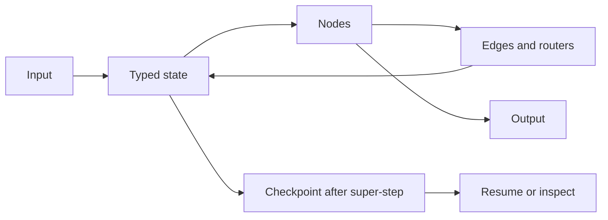
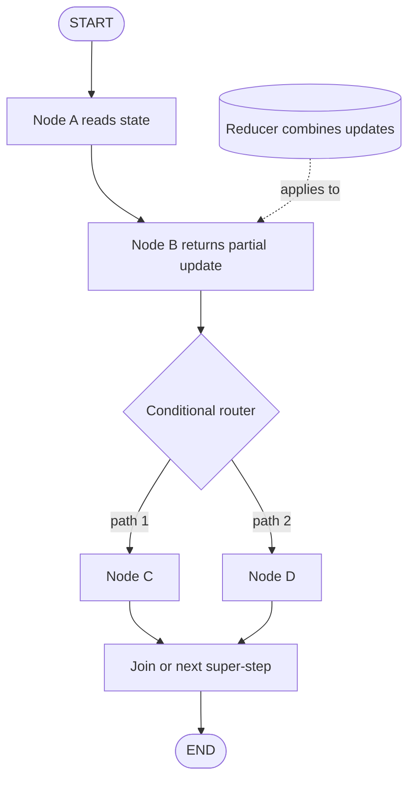
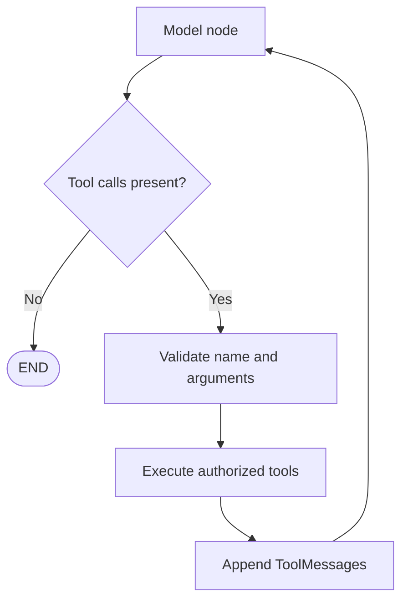
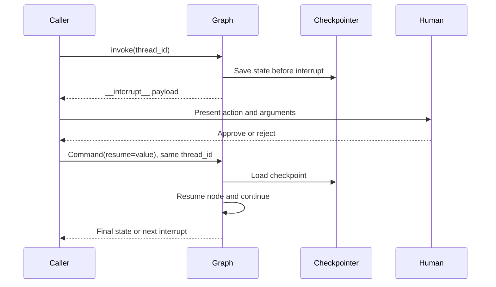
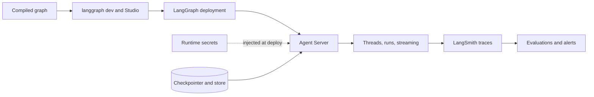

# LangGraph Python Handbook

> A focused, Python-only guide to the current LangGraph runtime. Examples target the current LangGraph 1.x APIs documented at [LangGraph for Python](https://docs.langchain.com/oss/python/langgraph/overview).

## 1. Mental Model

LangGraph models an application as a stateful program made of:

- **State**: the typed data snapshot shared by nodes.
- **Nodes**: Python functions that read state and return partial updates.
- **Edges**: fixed or conditional transitions that choose the next node.

Execution proceeds in discrete **super-steps**. Parallel nodes in one super-step can update the same state; reducers determine how concurrent or successive updates combine. A graph must be compiled before invocation. See the [Graph API overview](https://docs.langchain.com/oss/python/langgraph/graph-api).

LangGraph is lower-level infrastructure. LangChain's [`create_agent`](https://docs.langchain.com/oss/python/langchain/agents) returns a compiled LangGraph graph for the common tool-calling agent loop; use custom LangGraph when you need explicit topology, durable steps, branching, approval gates, or custom state.



## 2. Choosing An API

### Graph API

Use [`StateGraph`](https://reference.langchain.com/python/langgraph/graph/state/StateGraph) when the workflow is easier to explain as a topology: explicit nodes, branches, loops, parallel fan-out, joins, and inspectable state. It also gives you graph visualization with `graph.get_graph()`.

```python
from typing_extensions import TypedDict
from langgraph.graph import END, START, StateGraph


class State(TypedDict):
    topic: str
    answer: str


def write_answer(state: State) -> dict[str, str]:
    return {"answer": f"Answer about {state['topic']}"}


builder = StateGraph(State)
builder.add_node("write_answer", write_answer)
builder.add_edge(START, "write_answer")
builder.add_edge("write_answer", END)
graph = builder.compile()

result = graph.invoke({"topic": "graphs"})
```

The shorthand `StateGraph(State).add_sequence([step_a, step_b])` is useful for linear flows. See [create a sequence](https://docs.langchain.com/oss/python/langgraph/use-graph-api#why-split-application-steps-into-a-sequence-with-langgraph).

### Functional API

Use [`@entrypoint`](https://reference.langchain.com/python/langgraph/func/entrypoint) and [`@task`](https://reference.langchain.com/python/langgraph/func/task) when ordinary Python control flow is the clearest design. `@entrypoint` defines the durable workflow; `@task` marks work that can be persisted, retried by the runtime, awaited, or run concurrently.

```python
from langgraph.func import entrypoint, task


@task
def double(value: int) -> int:
    return value * 2


@entrypoint()
def workflow(value: int) -> int:
    return double(value).result()


assert workflow.invoke(21) == 42
```

The APIs share the same runtime and can call one another. Graph API checkpoints occur after super-steps; Functional API task results are saved to the entrypoint checkpoint. Functional workflows are not statically visualized. See [Functional API](https://docs.langchain.com/oss/python/langgraph/functional-api) and [using it](https://docs.langchain.com/oss/python/langgraph/use-functional-api).

## 3. State And Reducers

The usual schema is a `TypedDict`; dataclasses are convenient for defaults, and Pydantic models are available when recursive validation matters, at some performance cost. State can have separate input/output schemas and private internal channels. See [state and schemas](https://docs.langchain.com/oss/python/langgraph/graph-api#state).

By default, a node update **overwrites** the corresponding key. A reducer receives `(current_value, node_update)` and returns the next value. Use `Annotated` to attach one:

```python
import operator
from typing import Annotated
from typing_extensions import TypedDict


class State(TypedDict):
    messages: Annotated[list[str], operator.add]
    status: str
```

`{"messages": ["new"]}` appends, while `{"status": "done"}` replaces. Reducers must be associative enough for your parallel topology; do not depend on an accidental ordering of parallel updates. The built-in [`MessagesState`](https://reference.langchain.com/python/langgraph/graph/messages/MessagesState) and [`add_messages`](https://reference.langchain.com/python/langgraph/graph/message/add_messages) are useful for message histories because they merge message IDs rather than blindly concatenating lists.

Keep state small and serializable. Put durable, cross-thread facts in a store rather than duplicating them in every checkpoint. Private channels are not automatically secret: `stream_mode="values"` can expose all channels unless you restrict `output_keys`. See [reducers](https://docs.langchain.com/oss/python/langgraph/graph-api#reducers).

## 4. Nodes, Edges, And Control Flow

### Nodes

A node can be synchronous or asynchronous and normally has the shape `node(state) -> dict`. It may also receive runtime context, a store, or return a [`Command`](https://docs.langchain.com/oss/python/langgraph/graph-api#command) for combined state update and routing.

```python
async def fetch(state: State) -> dict[str, str]:
    value = await fetch_from_service(state["topic"])
    return {"answer": value}
```

Keep side effects idempotent where possible. A node can be re-executed after a retry, resume, replay, or time-travel fork.

### Fixed edges

`START` is the virtual entry node; `END` is the virtual terminal node. A graph needs a path from `START`, and execution halts when no active nodes remain.

```python
builder.add_edge(START, "draft")
builder.add_edge("draft", "review")
builder.add_edge("review", END)
```

An edge from one source to several destinations creates parallel fan-out. A node with incoming edges from all branches acts as a synchronization point. See [edges](https://docs.langchain.com/oss/python/langgraph/graph-api#edges).

### Conditional routing

`add_conditional_edges(source, router, path_map)` calls a router with the current state. It may return one node name, `END`, or multiple destinations. Annotate the return type with `Literal` or pass a path map so the graph can be validated and visualized accurately.

```python
from typing import Literal
from langgraph.graph import END


def route(state: State) -> Literal["retry", "answer", END]:
    if state.get("status") == "retry":
        return "retry"
    if state.get("answer"):
        return "answer"
    return END


builder.add_conditional_edges(
    "check",
    route,
    {"retry": "retry", "answer": "answer", END: END},
)
```

For dynamic fan-out over items, use [`Send`](https://docs.langchain.com/oss/python/langgraph/graph-api#send) from a routing function. For state update plus immediate routing from a node, return `Command[Literal[...]]`. See [conditional branching](https://docs.langchain.com/oss/python/langgraph/use-graph-api#conditional-branching).



## 5. Tools And Tool Calling

A tool is a typed function exposed to a chat model. `bind_tools` only tells the model what it may request; your graph still executes the request and returns a `ToolMessage` (or use a ready-made tool node/agent).

```python
from langchain.chat_models import init_chat_model
from langchain.tools import tool


@tool
def add(a: int, b: int) -> int:
    """Add two integers."""
    return a + b


model = init_chat_model("provider:model", temperature=0)  # placeholder
model_with_tools = model.bind_tools([add])
response = model_with_tools.invoke("What is 2 + 3?")
print(response.tool_calls)  # The provider may return a tool request.
```

The canonical manual loop is: model node -> inspect the last `AIMessage.tool_calls` -> execute each requested tool -> append `ToolMessage`s -> loop back to the model; route to `END` when there are no tool calls. Validate tool names and arguments, enforce authorization and timeouts, and treat tool input as untrusted. See [LangChain tools](https://docs.langchain.com/oss/python/langchain/tools) and the [Python quickstart](https://docs.langchain.com/oss/python/langgraph/quickstart).

For a standard ReAct-style agent in current LangChain, prefer `from langchain.agents import create_agent`; it is built on LangGraph and supports tools, middleware, context, structured output, and checkpointers. See [agent migration](https://docs.langchain.com/oss/python/migrate/langchain-v1#migrate-to-create_agent).



## 6. Persistence, Threads, And Memory

Compile with a checkpointer to save a state snapshot at each super-step:

```python
from langgraph.checkpoint.memory import InMemorySaver

checkpointer = InMemorySaver()  # development/testing only
graph = builder.compile(checkpointer=checkpointer)
config = {"configurable": {"thread_id": "user-42-conversation-1"}}
graph.invoke({"topic": "first turn"}, config)
graph.invoke({"topic": "follow-up"}, config)  # resumes this thread
```

The `thread_id` is the durable cursor. Reusing it loads the thread; changing it starts a new one. `InMemorySaver` is process-local. Production needs a durable checkpointer integration; the [checkpointers guide](https://docs.langchain.com/oss/python/langgraph/checkpointers) lists options. Agent Server manages checkpoint infrastructure automatically.

Use `graph.get_state(config)` for the current snapshot and `graph.get_state_history(config)` for checkpoints. Checkpoints enable conversation continuity, interrupts, fault tolerance, and time travel. `update_state` creates a new checkpoint and does not rewrite history.

### Checkpointer versus store

| Concern | Checkpointer | Store |
| --- | --- | --- |
| Scope | One `thread_id` | Across threads |
| Data | Graph state snapshots | Application-defined key/value items |
| Use | Conversation memory, resume, HITL, replay | User preferences, facts, shared knowledge |
| Access | Graph config | Store namespace and key |

Use [`InMemoryStore`](https://reference.langchain.com/python/langgraph/store/memory/InMemoryStore) for development and a persistent provider such as Postgres, MongoDB, Redis, or Upstash in production. Compile with both and access the store through the injected [`Runtime`](https://reference.langchain.com/python/langgraph/runtime/Runtime):

```python
from dataclasses import dataclass
from langgraph.runtime import Runtime
from langgraph.store.memory import InMemoryStore


@dataclass
class Context:
    user_id: str


store = InMemoryStore()


def remember(state: State, runtime: Runtime[Context]) -> dict:
    namespace = (runtime.context.user_id, "memories")
    store.put(namespace, "favorite-topic", {"topic": state["topic"]})
    return {}


builder = StateGraph(State, context_schema=Context)
graph = builder.compile(checkpointer=checkpointer, store=store)
graph.invoke({"topic": "Python"}, config, context=Context(user_id="42"))
```

See [stores](https://docs.langchain.com/oss/python/langgraph/stores) and [persistence](https://docs.langchain.com/oss/python/langgraph/persistence). Do not put secrets in state or stores unless encryption, access control, retention, and redaction are designed explicitly.

## 7. Interrupts And Human-in-the-Loop

Dynamic HITL uses [`interrupt(payload)`](https://reference.langchain.com/python/langgraph/types/interrupt). It requires a checkpointer and a stable `thread_id`:

```python
from langgraph.types import interrupt


def approve(state: State) -> dict:
    decision = interrupt({"action": "approve", "draft": state["answer"]})
    return {"status": "approved" if decision else "rejected"}
```

The initial invocation returns an interrupt payload under `__interrupt__` with the default API. Resume the **same thread** with `Command(resume=value)`:

```python
from langgraph.types import Command

graph.invoke({"topic": "draft"}, config)
graph.invoke(Command(resume=True), config)
```

On resume, the node starts again from its beginning, so code before `interrupt()` must be safe to repeat. For several simultaneous interrupts, resume with a mapping from interrupt IDs to answers. An interrupt is not an ordinary exception: it bypasses retries and error handlers. See [interrupts](https://docs.langchain.com/oss/python/langgraph/interrupts).

For approval before a tool, put the interrupt immediately before the side effect or use LangChain's [`HumanInTheLoopMiddleware`](https://docs.langchain.com/oss/python/langchain/human-in-the-loop) for a standard agent.



## 8. Streaming

`graph.stream`/`graph.astream` support `values`, `updates`, `messages`, `custom`, `checkpoints`, `tasks`, and `debug` modes. Current docs recommend typed event streaming for new applications; for direct graph streams, prefer `version="v2"`:

```python
for part in graph.stream(
    {"topic": "ice cream"},
    stream_mode=["updates", "custom"],
    version="v2",
):
    if part["type"] == "updates":
        print(part["data"])
    elif part["type"] == "custom":
        print(part["data"])
```

`values` emits full state; `updates` emits node updates; `messages` emits model token chunks and metadata; `custom` emits data written through `get_stream_writer()`. `version="v2"` consistently yields `{"type", "ns", "data"}` and `ns` identifies a subgraph. Set `subgraphs=True` to include nested graph output. See [streaming](https://docs.langchain.com/oss/python/langgraph/streaming) and [event streaming](https://docs.langchain.com/oss/python/langgraph/event-streaming).

## 9. Subgraphs

Compile a child `StateGraph` and add the compiled graph as a parent node:

```python
child = StateGraph(ChildState)
child.add_node("step", child_step)
child.add_edge(START, "step")
child_graph = child.compile()

parent = StateGraph(ParentState)
parent.add_node("child", child_graph)
parent.add_edge(START, "child")
graph = parent.compile()
```

Use shared state keys when parent and child need direct data exchange. Otherwise map parent state to child state in a wrapper node. By default a child inherits the parent's checkpointer and is treated as one parent-level super-step. Compile a child with its own checkpointer when you need accumulated per-thread child state or finer-grained time travel. State access and subgraph inspection require the child to be statically discoverable; a subgraph hidden inside a tool is not statically inspectable, although interrupts still propagate. See [subgraphs](https://docs.langchain.com/oss/python/langgraph/use-subgraphs).

## 10. Fault Tolerance

Configure retries per node with [`RetryPolicy`](https://reference.langchain.com/python/langgraph/types/RetryPolicy):

```python
from langgraph.types import RetryPolicy

builder.add_node(
    "external_api",
    external_api,
    retry_policy=RetryPolicy(max_attempts=3),
)
```

Retries, timeouts, and error handlers compose in that order: each attempt runs, matching failures retry, and the error handler runs only after retries are exhausted. Current LangGraph supports async node timeouts with `timeout=` or `TimeoutPolicy`; sync nodes cannot use node timeouts directly. Use `asyncio.to_thread` for blocking I/O inside an async node. See [fault tolerance](https://docs.langchain.com/oss/python/langgraph/fault-tolerance).

Checkpointing also provides pending writes: if one parallel node fails, successful writes from that super-step need not be repeated when the run resumes. Still make external side effects idempotent and use provider-level idempotency keys.

## 11. Time Travel

Time travel has two forms:

- **Replay**: invoke using a prior checkpoint config; nodes after that checkpoint execute again.
- **Fork**: call `update_state` against a prior checkpoint, then invoke the returned config to explore a modified branch.

```python
history = list(graph.get_state_history(config))
before_review = next(snapshot for snapshot in history if snapshot.next == ("review",))

# Replay. Nodes after this checkpoint run again.
graph.invoke(None, before_review.config)

# Fork. The original history remains intact.
fork_config = graph.update_state(
    before_review.config,
    values={"answer": "alternative draft"},
)
graph.invoke(None, fork_config)
```

Replay is not a cache: LLM calls, APIs, and interrupts can produce different results. Interrupts are re-triggered during replay. See [time travel](https://docs.langchain.com/oss/python/langgraph/use-time-travel).

## 12. Workflows Versus Agents

The [workflows and agents guide](https://docs.langchain.com/oss/python/langgraph/workflows-agents) distinguishes:

- **Workflow**: predetermined code paths. Prefer fixed edges, structured outputs, validators, branches, and explicit retries when reliability and auditability matter.
- **Agent**: dynamic model-directed process and tool selection. Use a tool-calling loop or `create_agent` when the model must decide the next action.

Many useful systems are hybrids: a deterministic outer graph with an agent subgraph for one bounded research step, followed by validation and approval. Bound agent loops with a maximum iteration count, tool allowlist, budgets, and termination conditions.

## 13. Testing

Test pure nodes and routers as ordinary Python functions, then test compiled paths with a fresh checkpointer per test. The current [LangGraph testing guide](https://docs.langchain.com/oss/python/langgraph/test) recommends `pytest` and `InMemorySaver`:

```python
def test_graph_path() -> None:
    graph = make_graph().compile(checkpointer=InMemorySaver())
    result = graph.invoke(
        {"topic": "test"},
        config={"configurable": {"thread_id": "test-1"}},
    )
    assert result["answer"]
```

Use `graph.nodes["node_name"].invoke(...)` to unit-test an individual compiled node; this bypasses checkpointer behavior. For partial execution, seed a checkpoint with `update_state(..., as_node="previous_node")` and stop with `interrupt_after`. Add tests for reducers, conditional routes, retries, duplicate/resume behavior, interrupts, tool errors, and serialization boundaries. Keep model calls behind injected fakes or deterministic fixtures.

## 14. Studio, Observability, And Deployment

### Studio

[LangSmith Studio](https://docs.langchain.com/oss/python/langgraph/studio) connects to a local Agent Server, visualizes graph steps, prompts, tool calls, state, errors, and threads, and supports hot reload. Python 3.11+ is required for the current CLI setup:

```bash
pip install --upgrade "langgraph-cli[inmem]"
langgraph dev
```

The CLI reads a `langgraph.json` such as:

```json
{
  "dependencies": ["."],
  "graphs": {"agent": "./src/agent.py:graph"},
  "env": ".env"
}
```

Use placeholders in documentation and keep `.env` out of version control. Studio can be used with tracing disabled via `LANGSMITH_TRACING=false`; otherwise configure a real `LANGSMITH_API_KEY` locally, never in source.

### Observability

[LangSmith Observability](https://docs.langchain.com/langsmith/observability) records traces of graph runs, node transitions, prompts, model calls, tool arguments/results, latency, tokens, errors, and feedback. Set tracing environment variables in the runtime environment, tag runs with deployment/user/thread metadata, and redact secrets or sensitive payloads before sending traces. Use traces to build regression datasets and online/offline evaluations; dashboards and alerts catch production drift.

### Deployment

The [LangSmith Deployment](https://docs.langchain.com/langsmith/deployment) Agent Server provides durable execution, threads, assistants, runs, streaming, and horizontal scaling. A typical path is:

1. Export a compiled graph from `langgraph.json`.
2. Test locally with `langgraph dev` and Studio.
3. Build/deploy with the [LangGraph CLI](https://docs.langchain.com/langsmith/cli), for example `langgraph deploy` for supported Cloud deployments.
4. Choose Cloud, hybrid, self-hosted control plane, or standalone server according to residency and operations requirements.

Agent Server handles checkpointer/store infrastructure for its deployment environment. Provider credentials and LangSmith credentials remain deployment secrets, not code constants. Treat `langgraph deploy` as beta where the current deployment quickstart labels it so.



## 15. Migration From Legacy APIs

For LangChain v1, use the [migration guide](https://docs.langchain.com/oss/python/migrate/langchain-v1):

| Legacy | Current |
| --- | --- |
| `langgraph.prebuilt.create_react_agent` | `langchain.agents.create_agent` |
| `prompt=` | `system_prompt=` |
| `pre_model_hook`, `post_model_hook`, `state_modifier` | Agent middleware (`before_model`, `after_model`, wrappers) |
| Prompted structured output tuples | `ToolStrategy` or `ProviderStrategy` |
| Stream node name `"agent"` | `"model"` |
| Runtime dependencies only in `configurable` | `context=` plus `context_schema=` |
| Legacy chains/retrievers/indexes/hub | `langchain-classic` and `langchain_classic.*` |

Do not mechanically mix old examples with current imports. Search for `create_react_agent`, `langgraph.prebuilt`, old hooks, and legacy `langchain.chains` imports. Preserve old APIs only when a concrete compatibility constraint exists; otherwise migrate to current namespaces and test stream event names and state schemas.

## 16. Complete Runnable Mini-Project

This project is deterministic and needs no model provider or secret. It demonstrates typed state, a reducer, fixed and conditional edges, a local tool-call-shaped loop, persistence, streaming, and HITL. Replace the deterministic planner with a real `model.bind_tools(...)` call only after configuring a provider.

Install:

```bash
python -m pip install -U langgraph langchain-core
```

Save as `mini_langgraph.py` and run `python mini_langgraph.py`:

```python
from __future__ import annotations

import operator
from typing import Annotated, Literal
from typing_extensions import TypedDict

from langgraph.checkpoint.memory import InMemorySaver
from langgraph.graph import END, START, StateGraph
from langgraph.types import Command, interrupt


class State(TypedDict):
    request: str
    numbers: list[int]
    tool_calls: Annotated[list[str], operator.add]
    answer: str
    approved: bool


def parse_request(state: State) -> dict:
    # Deterministic stand-in for an LLM planner.
    numbers = [int(token) for token in state["request"].split() if token.isdigit()]
    if len(numbers) != 2:
        raise ValueError("Request must contain exactly two integers")
    return {"numbers": numbers}


def route_after_parse(state: State) -> Literal["calculate", END]:
    return "calculate" if len(state.get("numbers", [])) == 2 else END


def calculate(state: State) -> dict:
    a, b = state["numbers"]
    # This is the tool execution step. A real model would produce this request.
    return {
        "tool_calls": [f"add(a={a}, b={b})"],
        "answer": str(a + b),
    }


def approve(state: State) -> dict:
    decision = interrupt(
        {"kind": "approval", "question": f"Approve answer {state['answer']}?"}
    )
    return {"approved": bool(decision)}


def route_after_approval(state: State) -> Literal["publish", END]:
    return "publish" if state.get("approved") else END


def publish(state: State) -> dict:
    return {"answer": f"The answer is {state['answer']}"}


def build_graph():
    builder = StateGraph(State)
    builder.add_node("parse_request", parse_request)
    builder.add_node("calculate", calculate)
    builder.add_node("approve", approve)
    builder.add_node("publish", publish)
    builder.add_edge(START, "parse_request")
    builder.add_conditional_edges(
        "parse_request", route_after_parse, {"calculate": "calculate", END: END}
    )
    builder.add_edge("calculate", "approve")
    builder.add_conditional_edges(
        "approve", route_after_approval, {"publish": "publish", END: END}
    )
    builder.add_edge("publish", END)
    return builder.compile(checkpointer=InMemorySaver())


if __name__ == "__main__":
    graph = build_graph()
    config = {"configurable": {"thread_id": "demo-thread"}}
    initial = {"request": "Add 20 and 22", "tool_calls": []}

    print("Streaming updates:")
    for part in graph.stream(initial, config, stream_mode="updates", version="v2"):
        print(part["data"])

    # The run pauses at approve. Resume the same thread with human approval.
    resumed = graph.invoke(Command(resume=True), config)
    print("Final:", resumed["answer"])
```

Expected final output includes `The answer is 42`. The example uses `InMemorySaver` intentionally so it is self-contained; replace it with a durable integration before using threads or interrupts in production. A real tool-calling planner would use the model/tool pattern in [Tools And Tool Calling](#5-tools-and-tool-calling), and a real deployment would export `graph` through `langgraph.json` as described in [Deployment](#deployment).

## Practical Checklist

- Define the smallest state that makes the workflow deterministic and inspectable.
- Use reducers intentionally, especially for parallel writes and message history.
- Make retries, timeouts, tool permissions, and loop termination explicit.
- Compile with a checkpointer for threads, HITL, recovery, or time travel.
- Use a store for cross-thread memory, not the checkpointer as a global database.
- Treat replay and resume as re-execution; make side effects idempotent.
- Test routers, reducers, node failures, interrupts, and tool errors without real providers.
- Stream only the state and channels the caller is allowed to see.
- Trace with LangSmith after redaction and deploy with secrets supplied by the runtime.
- Check the current official docs before pinning versions or copying provider-specific examples.

## Caveats

- LangGraph and LangChain APIs evolve quickly; verify package versions against the current [Python reference](https://reference.langchain.com/python/langgraph/) and the linked docs.
- Some features in this handbook, notably node timeouts and typed event-stream projections, have minimum-version requirements stated in their source guides.
- `InMemorySaver` and `InMemoryStore` are for local development/testing, not durable production persistence.
- The mini-project intentionally uses no real LLM or secrets, so its planner is deterministic rather than probabilistic model tool calling.
