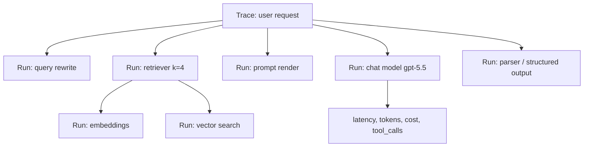
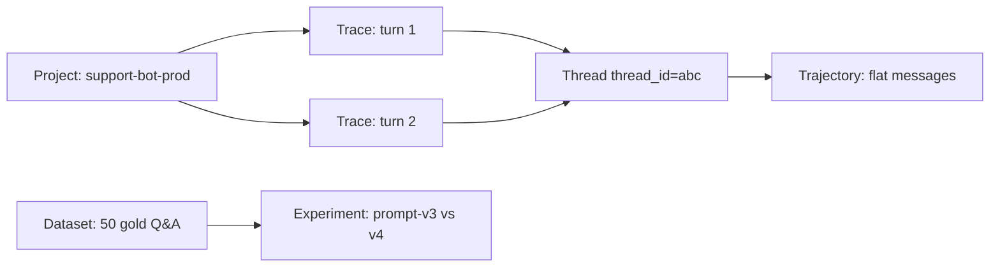
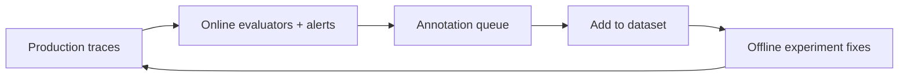

# LangSmith Handbook (Python, Latest)

## Learning objectives

- Explain observability (logs/metrics/traces) and why LLM apps need tracing.
- Describe LangSmith data model: runs, traces, threads, trajectories, projects.
- Instrument any code with auto-tracing, `@traceable`, and metadata/tags.
- Build datasets, run offline experiments, and score with code + LLM-as-judge evaluators.
- Wire online monitoring so production failures become regression tests.

## 1. Observability globally (before LangSmith)

Traditional backends fail loudly (500, stack trace). LLM apps fail **silently**:
fluent but wrong answer, missing citation, wrong tool args, slow but successful.
You cannot reproduce from the final text alone — you need the intermediate steps.

### 1.1 Three pillars

| Signal | What | Example | LLM gap |
| --- | --- | --- | --- |
| Logs | Discrete events | `retriever returned 0 hits` | Drowns in prompt text |
| Metrics | Aggregates over time | p95 latency, error rate, tokens/$ | No why per request |
| Traces | Tree of spans for one operation | query -> rewrite -> retrieve -> rerank -> prompt -> model -> parse | **Exactly what LLM apps need** |

LangSmith = traces-first observability + evals + prompt hub, where a LangSmith
**run** ≈ an OpenTelemetry **span**.



### 1.2 What to observe per request

- inputs/outputs per step (prompt text, retrieved chunks + scores, tool args/result),
- model id + params, token usage + cost, latency per run,
- user/session ids (after redaction), app version, env,
- feedback (thumbs up/down, human label, evaluator score).

Golden rule: **without a trace you only see the bad answer; with a trace you see
which step caused it.**

---

## 2. What LangSmith is (and is not)

LangSmith is the **trace + eval + monitor** layer for LangChain, LangGraph,
and any Python/JS app (OpenAI, Anthropic SDKs auto-instrumented).

Use it for: debugging one bad run, regression-testing prompt/model changes,
monitoring production quality/cost, versioning prompts, collecting human labels.

It is not: a vector DB, a model provider, or a replacement for unit tests.

### 2.1 Data model

| Concept | Shape | Reach for it when |
| --- | --- | --- |
| **Run** | One unit of work (model call, tool, retriever, parser) | Inspect a single step's I/O |
| **Trace** | Tree of runs for one operation (max 25k runs) | Debug why one request failed/slow |
| **Thread** | Sequence of traces for a multi-turn session (`thread_id`) | Follow conversation across turns |
| **Trajectory** | Flat ordered message list projected from a thread | Read what was said without nesting |
| **Project** | Container for an app/service's traces | Separate dev/staging/prod |
| **Feedback** | Score/tag on a run (`key`, `score|value`, `comment`) | Human or evaluator judgment |
| **Dataset / Example** | Curated test cases (`inputs`, `reference_outputs`, `metadata`) | Offline evals |
| **Experiment** | One app version run over a dataset | Compare prompts/models |



Retention: SaaS traces kept ~180 days; **datasets persist indefinitely** — promote
important traces to datasets before they expire.

---

## 3. Setup (real usage)

```bash
pip install -U langsmith langchain openai
```

```python
import os
os.environ["LANGSMITH_TRACING"] = "true"   # auto-trace LangChain/LangGraph/OpenAI
os.environ["LANGSMITH_API_KEY"] = "lsv2_..."  # from smith.langchain.com
os.environ["LANGSMITH_PROJECT"] = "support-bot-dev"
# Optional: os.environ["LANGSMITH_ENDPOINT"] = "https://api.smith.langchain.com"
# Optional: os.environ["OPENAI_API_KEY"] = "sk-..."
```

Verify: run any LangChain chain once, then check the project in LangSmith UI —
you should see 1 trace with N runs (prompt, model, parser, retriever).

```python
from langchain.chat_models import init_chat_model
model = init_chat_model("openai:gpt-5.5")
print(model.invoke("Say hi in one sentence.").text)  # appears in LangSmith
```

---

## 4. Tracing: auto, `@traceable`, manual

### 4.1 Auto-tracing (zero code)

LangChain, LangGraph, and supported integrations emit runs automatically when
`LANGSMITH_TRACING=true`. No decorator needed for `chain.invoke()` or `agent.invoke()`.

### 4.2 `@traceable` — trace any function (most important API)

```python
from langsmith import traceable

@traceable(name="rewrite_query", tags=["rag", "rewrite"], metadata={"version": "v3"})
def rewrite_query(question: str) -> str:
    # any logic: LLM call, regex, heuristics — all captured as a run
    return question.strip().replace("plz", "please")

@traceable(name="rag_answer")
def answer(question: str) -> str:
    q = rewrite_query(question)          # nested run under same trace
    docs = retrieve(q)                   # if retrieve is @traceable, also nested
    return generate(q, docs)

print(answer("plz refund window?"))  # 1 trace: answer -> rewrite_query -> retrieve -> generate
```

Rules:

- Sync + async both supported (`@traceable` detects).
- Args become run inputs, return value becomes run output (must be JSON-serializable-ish).
- `name`, `tags`, `metadata` make filtering possible later.
- Set `client=` explicitly in notebooks/tests if env differs.

Hiding PII:

```python
from langsmith import traceable

@traceable(process_inputs=lambda d: {"question": "[REDACTED]"})
def answer_private(question: str) -> str:
    return f"Answer for len={len(question)}"
```

### 4.3 Manual enrichment: tags, metadata, thread

```python
from langsmith import traceable

@traceable(tags=["prod", "rag"], metadata={"app_version": "1.4.0", "env": "prod"})
def rag_answer(question: str, user_id: str) -> str:
    return "..."

# group multi-turn traces:
rag_answer.invoke if False else None
# pass via langchain config instead:
# chain.invoke({"question": "..."}, config={"tags": ["demo"], "metadata": {"thread_id": "abc", "user_id": "u42"}})
```

In LangChain, prefer `config={"tags":..., "metadata": {"thread_id": ...}}` so all
child runs inherit them. `thread_id` links traces into a thread.

### 4.4 `trace` context manager + `RunTree` (escape hatches)

```python
from langsmith import trace

with trace(name="nightly_ingest", tags=["cron"], metadata={"shard": 7}) as rt:
    rt.add_metadata({"docs": 120})
    ...  # everything @traceable inside joins this trace
```

`RunTree` = low-level explicit construction; use only when decorator/context
cannot express parent/child (rare).

### 4.5 Debugging checklist with traces

RAG failure — inspect in order:

1. user question, 2. rewritten query, 3. filters, 4. retrieved chunks + scores,
5. reranker output, 6. final context, 7. rendered prompt, 8. answer + citations.

Agent failure — inspect:

1. system prompt, 2. tool list, 3. model tool decision, 4. tool args,
5. tool result, 6. next decision, 7. stop condition, 8. retry path.

In UI use filter `tags:prod AND latency>5s`, group by `metadata.app_version`,
compare a good vs bad trace side-by-side.

---

## 5. Datasets: turn traces into regression tests

Dataset = list of examples. Example = `{inputs, reference_outputs?, metadata?}`.

```json
{
  "inputs": {"question": "What is the expense submission deadline?"},
  "reference_outputs": {"answer": "30 days after transaction date."},
  "metadata": {"category": "policy", "expected_source": "travel_policy_2026"}
}
```

### 5.1 Create from SDK (real usage)

```python
from langsmith import Client

client = Client()
ds = client.create_dataset("support-gold-v1", description="20 curated support Q&A")

client.create_examples(
    dataset_id=ds.id,
    examples=[
        {"inputs": {"question": "Refund window?"},
         "outputs": {"answer": "30 days with receipt."},
         "metadata": {"category": "policy"}},
        {"inputs": {"question": "Reset password?"},
         "outputs": {"answer": "Settings > Security > Reset."},
         "metadata": {"category": "howto"}},
    ],
)
```

Promote production failures: in UI open bad run -> `Add to dataset` -> fix
`reference_outputs` -> it becomes a regression case. Filter first:
`feedback:thumbs_down OR latency>8s`.

Splits: `train/validation/test` or `policy/howto` — evaluate per slice, not just global average.
Version + tag datasets before CI (`v1.2-release`).

---

## 6. Evaluators: code, LLM-as-judge, pairwise, human

Evaluators are workspace-level scorers returning **feedback**:
`{"key": ..., "score"|"value": ..., "comment": ...}`.

| Type | Needs reference? | Offline | Online | Use for |
| --- | --- | --- | --- | --- |
| Code (deterministic) | sometimes | yes | yes | Exact match, schema, citations, latency |
| LLM-as-judge | reference-free or based | yes | yes (free only) | Groundedness, helpfulness, safety |
| Pairwise | no | yes | limited | A/B: which summary better? |
| Human (annotation queue) | no | yes | yes | Gold labels, disputed cases |

### 6.1 Code evaluators

```python
def exact_match(run, example):
    pred = (run.outputs.get("answer") or "").strip().lower()
    gold = (example.outputs.get("answer") or "").strip().lower()
    return {"key": "exact_match", "score": float(pred == gold)}

def has_citation(run, example):
    text = run.outputs.get("answer") or ""
    return {"key": "has_citation", "score": float("[1]" in text or "src=" in text),
            "comment": "checks citation marker"}

def valid_schema(run, example):
    try:
        assert isinstance(run.outputs, dict) and "answer" in run.outputs
        return {"key": "valid_schema", "score": 1.0}
    except AssertionError:
        return {"key": "valid_schema", "score": 0.0}
```

### 6.2 LLM-as-judge (real usage)

```python
# pip install -U openevals langsmith
from openevals import create_llm_as_judge
from openevals.prompts import CORRECTNESS_PROMPT  # or RAG_GROUNDEDNESS_PROMPT

correctness = create_llm_as_judge(
    prompt=CORRECTNESS_PROMPT,
    model="openai:gpt-5-mini",   # small grader is cheaper + often sufficient
    feedback_key="correctness",
)

# custom rubric:
groundedness = create_llm_as_judge(
    prompt="Rate 0-1 whether ANSWER is fully supported by CONTEXT. Reply with score and reason.\n"
           "CONTEXT:\n{context}\nANSWER:\n{answer}",
    model="openai:gpt-5-mini",
    feedback_key="groundedness",
)
```

Tips: few-shot grader prompts beat zero-shot; grade with a **different**
model family than generator when possible; always spot-check 20 grades by hand;
log grader prompt version in metadata.

### 6.3 Pairwise + human

- Pairwise: compare `experiment A vs B` side-by-side in UI or `evaluate_pairwise`;
  good when absolute scoring is hard (tone, summary quality).
- Human: `Annotation queues` — single-run (label one trace against rubric) or
  pairwise (pick better of two). Export labels -> dataset -> future offline evals.

---

## 7. Offline experiments (pre-deployment)

```python
from langsmith import Client
from langsmith.evaluation import evaluate

def target(inputs: dict) -> dict:
    # your app under test: must take example.inputs, return dict
    return {"answer": rag_chain.invoke(inputs["question"])}

results = evaluate(
    target,
    data="support-gold-v1",
    evaluators=[exact_match, has_citation, correctness],
    experiment_prefix="rag-prompt-v4-k4",
    max_concurrency=4,
)
print(results)
```

Compare experiments: prompt-v3 vs v4, `k=2 vs 4`, `gpt-5-mini vs sonnet`, chunk 400 vs 800.
Do not trust one-off manual tests — require experiment win before merging.

pytest integration exists (`langsmith.pytest`) so evals run in CI like tests;
assert on metrics (e.g. `correctness >= 0.85`) to block regressions.

---

## 8. Online evaluation + monitoring (post-deployment)

Online evals score **live runs/threads** (no reference outputs). Attach evaluators
to a tracing project with sampling + filters + spend limits.

Monitor:

- error rate, p50/p95 latency, tokens/$, refusal rate, empty-retrieval rate,
- `groundedness` (reference-free judge), toxicity/PII, tool failure rate,
- user `thumbs_down` rate per `app_version`.

Loop:



When users report failures, convert those traces to dataset examples **same day**.

---

## 9. Practical considerations

- Redact PII at the edge (`process_inputs`), set retention + access policies per env.
- Separate projects: `app-dev`, `app-staging`, `app-prod`; tag `app_version`, `env`.
- Sampling: 100% in dev, sampled (e.g. 10%) + all errors in prod to control spend.
- Evaluator spend limits: cap LLM-judge tokens per project/dataset.
- Prompt Hub: version prompts, don't hardcode strings in 5 files.

## 10. Summary cheat sheet

- Observability = logs + metrics + **traces**; LLM apps live in traces.
- Model: run < trace < thread < trajectory, all inside a project.
- `@traceable(name, tags, metadata)` traces anything; `config` propagates tags/`thread_id`.
- Datasets (`inputs/outputs/metadata`) + experiments = regression testing.
- Evaluators: code (exact/schema/citation) + LLM-as-judge (correctness/groundedness) + pairwise + human queues.
- Online finds issues -> offline proves fixes -> online confirms.

## 11. Resources and references

- Observability concepts: <https://docs.langchain.com/langsmith/observability-concepts>
- Evaluation concepts: <https://docs.langchain.com/langsmith/evaluation-concepts>
- Tracing quickstart: <https://docs.langchain.com/langsmith/trace-with-langchain>
- Annotate code: <https://docs.langchain.com/langsmith/annotate-code>
- LLM-as-judge: <https://docs.langchain.com/langsmith/llm-as-judge>
- Datasets: <https://docs.langchain.com/langsmith/manage-datasets>
- MCP servers (in `.opencode/opencode.json`): `https://docs.langchain.com/mcp`, `https://reference.langchain.com/mcp`

## 12. Self-check questions

1. Trace vs thread vs trajectory — which view answers "why did this one request fail"?
2. Write `@traceable` for a `retrieve()` fn with tags + redacted inputs.
3. When can you use reference-based evaluators vs reference-free ones?
4. Sketch the loop from a production `thumbs_down` to a new dataset example to a passing experiment.
5. Which 5 metrics would you alert on for a prod RAG bot and why?
