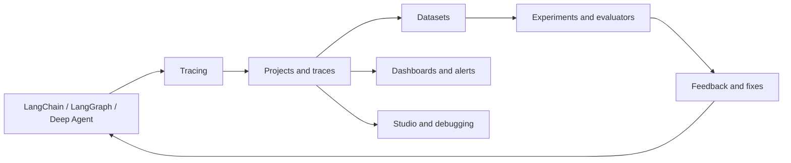
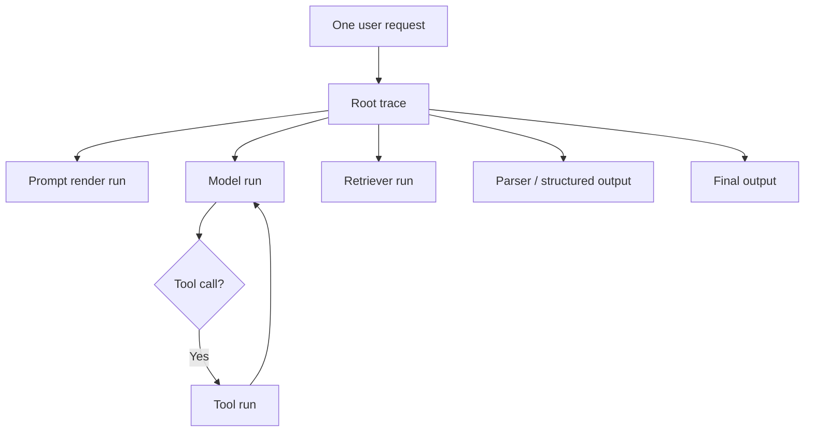
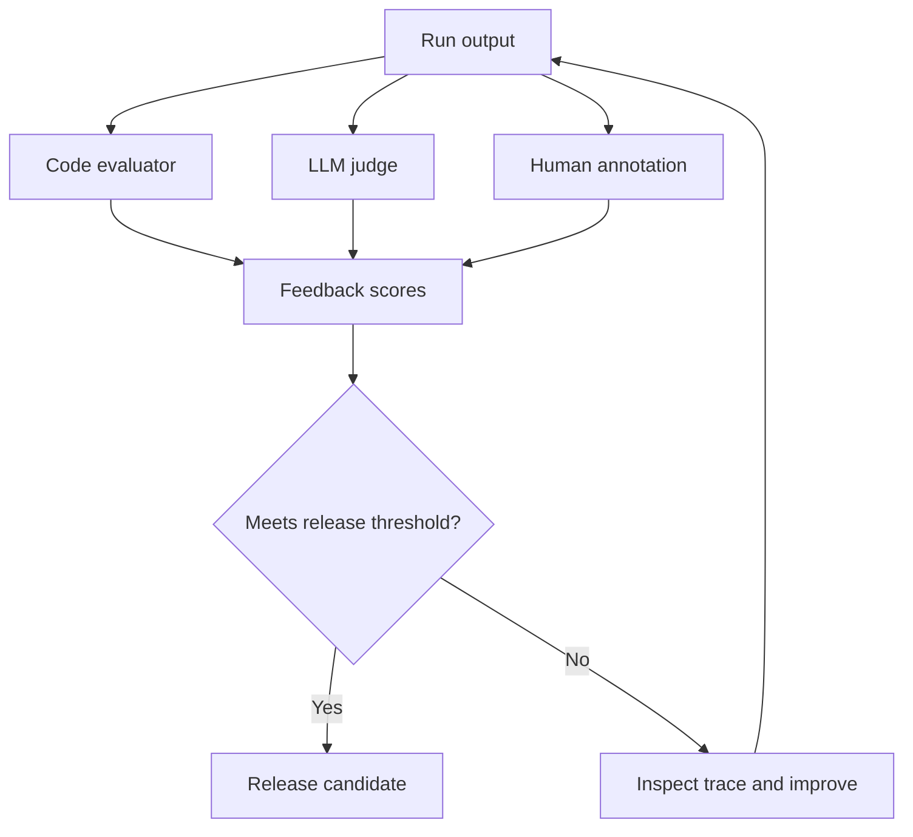
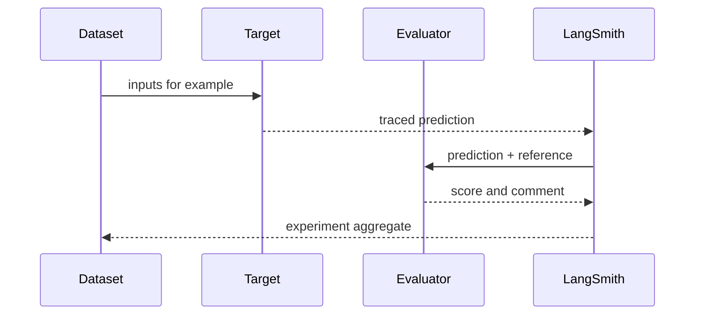
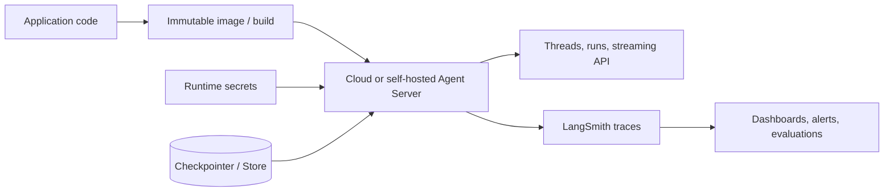

# LangSmith Python Handbook

LangSmith is the observability, evaluation, prompt-management, and deployment
platform for LLM applications. It complements LangChain, LangGraph, Deep Agents,
and non-LangChain applications. The [observability concepts](https://docs.langchain.com/langsmith/observability-concepts),
[evaluation concepts](https://docs.langchain.com/langsmith/evaluation-concepts),
and [Python SDK reference](https://reference.langchain.com/python/langsmith/) are
the authoritative sources for current behavior.

## 1. What LangSmith solves

LLM failures are often plausible rather than exceptional: a wrong tool argument,
weak retrieval, prompt injection, hallucinated citation, or slow retry can all
produce a successful HTTP response. LangSmith records the intermediate work so
you can debug, evaluate, and monitor it.

| Capability | Use |
| --- | --- |
| Tracing | inspect model, tool, retriever, parser, and graph steps |
| Projects | separate development, staging, and production traffic |
| Datasets | store regression examples and references |
| Evaluations | score quality with code, judges, pairwise, or humans |
| Prompts | version and reuse prompts |
| Feedback | capture user and evaluator judgments |
| Studio | inspect and interact with graph applications |
| Deployment | run managed or self-hosted agent services |

LangSmith is not a model provider, vector database, or replacement for unit
tests. See the [platform overview](https://docs.langchain.com/langsmith/overview).



## 2. Setup and environment

Install the SDK and the evaluation helpers used by your project:

```bash
python -m pip install -U langsmith openevals
```

Tracing configuration uses environment variables. Do not place real values in
source or documentation:

```text
LANGSMITH_TRACING=true
LANGSMITH_API_KEY=YOUR_LANGSMITH_API_KEY
LANGSMITH_PROJECT=YOUR_PROJECT_NAME
LANGSMITH_ENDPOINT=https://api.smith.langchain.com
```

See [environment variables](https://docs.langchain.com/langsmith/env-var) and
[create an API key](https://docs.langchain.com/langsmith/create-account-api-key).
Use separate projects and keys for development, staging, and production.

## 3. Data model

| Object | Meaning |
| --- | --- |
| Run | One unit of work, such as a model call or tool execution |
| Trace | A tree of runs for one user request |
| Thread | Related multi-turn traces, usually connected by a thread ID |
| Project | A named container for traces |
| Dataset | Curated input/output examples |
| Example | One dataset test case |
| Experiment | One target evaluated across a dataset |
| Feedback | Score, value, or comment attached to a run |
| Prompt commit | A versioned prompt in the prompt workspace |
| Annotation queue | Human review workflow |

Use tags for filtering and metadata for dimensions such as application version,
tenant, environment, and feature flag. Never use metadata as a substitute for
access control.

## 4. Automatic tracing

LangChain and LangGraph integrations emit child runs when tracing is enabled:

```python
import os

os.environ["LANGSMITH_TRACING"] = "true"
os.environ["LANGSMITH_API_KEY"] = "YOUR_LANGSMITH_API_KEY"
os.environ["LANGSMITH_PROJECT"] = "YOUR_PROJECT_NAME"

from langchain.chat_models import init_chat_model

model = init_chat_model("PROVIDER:MODEL_NAME")
print(model.invoke("Say hello in one sentence.").text)
```

The [LangChain tracing guide](https://docs.langchain.com/langsmith/trace-with-langchain)
and [LangGraph tracing guide](https://docs.langchain.com/langsmith/trace-with-langgraph)
cover integration-specific configuration. OpenAI, Anthropic, and other supported
SDKs can also be traced directly; see the [integration list](https://docs.langchain.com/langsmith/integrations).



## 5. Trace arbitrary Python code

`@traceable` is the most useful SDK decorator for application functions:

```python
from langsmith import traceable

@traceable(
    name="rewrite_query",
    tags=["retrieval"],
    metadata={"component_version": "1"},
)
def rewrite_query(question: str) -> str:
    return question.strip()

@traceable(name="answer_request")
def answer_request(question: str) -> str:
    return f"Answer for: {rewrite_query(question)}"

print(answer_request("  What is RAG?  "))
```

Decorator options include `name`, `run_type`, `tags`, `metadata`, `client`,
`process_inputs`, `process_outputs`, and `reduce_fn` for streaming. Async
functions are supported. Use `process_inputs` and `process_outputs` to redact
personal or secret data before it reaches the service. See [annotate code](https://docs.langchain.com/langsmith/annotate-code).

```mermaid
flowchart LR
    I[Function inputs] --> R[process_inputs]
    R --> T[@traceable run]
    T --> C[Child traced calls]
    C --> O[Function output]
    O --> S[process_outputs]
    S --> L[LangSmith trace]
```

For lower-level control, use the [`trace` context manager](https://docs.langchain.com/langsmith/nest-traces)
or `RunTree`. Prefer decorators and framework callbacks unless you need custom
parent/child relationships.

## 6. Tags, metadata, feedback, and privacy

LangChain run configuration propagates trace context:

```python
result = chain.invoke(
    {"question": "What is retrieval?"},
    config={
        "tags": ["staging", "rag"],
        "metadata": {
            "app_version": "2026.1",
            "thread_id": "THREAD_ID",
        },
    },
)
```

Capture explicit user feedback with the SDK client:

```python
from langsmith import Client

client = Client()
client.create_feedback(
    run_id="RUN_ID",
    key="user_rating",
    score=1.0,
    comment="Helpful answer",
)
```

Apply [redaction](https://docs.langchain.com/langsmith/mask-inputs-outputs),
retention, workspace access controls, and sampling before production traffic is
enabled. Avoid logging credentials, payment data, health data, or raw user
documents unless your governance policy explicitly allows it.

## 7. Datasets

Datasets turn expected behavior into repeatable tests:

```python
from langsmith import Client

client = Client()
dataset = client.create_dataset(
    dataset_name="support-regression-v1",
    description="Curated support questions",
)
client.create_examples(
    inputs=[
        {"question": "What is the refund window?"},
        {"question": "How do I reset my password?"},
    ],
    outputs=[
        {"answer": "Contact support with a receipt."},
        {"answer": "Use the security settings page."},
    ],
    dataset_id=dataset.id,
)
```

Datasets can be created from SDK code, CSV/JSON, traces, or the UI. Store
metadata such as category, expected source, difficulty, and version. Split data
into development, validation, and test sets. See [manage datasets](https://docs.langchain.com/langsmith/manage-datasets).

## 8. Evaluators

### Deterministic evaluator

```python
def has_answer(run, example):
    output = run.outputs or {}
    text = str(output.get("answer", ""))
    return {
        "key": "has_answer",
        "score": float(bool(text.strip())),
        "comment": "Output must contain non-empty answer text.",
    }
```

### LLM-as-judge

```python
from openevals.llm import create_llm_as_judge

judge = create_llm_as_judge(
    prompt=(
        "Score whether the answer is grounded in the context from 0 to 1.\n"
        "Context: {context}\nAnswer: {answer}"
    ),
    feedback_key="groundedness",
    model="PROVIDER:GRADER_MODEL_NAME",
)
```

Evaluators may be reference-based, reference-free, pairwise, or human. Use
deterministic checks for schemas, citations, and exact values; use judges for
groundedness, helpfulness, tone, and safety; spot-check judge results manually.
See [LLM-as-judge](https://docs.langchain.com/langsmith/llm-as-judge),
[evaluation types](https://docs.langchain.com/langsmith/evaluation-types), and
[annotation queues](https://docs.langchain.com/langsmith/annotation-queues).



## 9. Offline experiments

Evaluate the application target against a dataset before changing production:

```python
from langsmith import evaluate

def target(inputs: dict) -> dict:
    answer = "YOUR_APPLICATION_CALL(inputs['question'])"
    return {"answer": answer}

results = evaluate(
    target,
    data="support-regression-v1",
    evaluators=[has_answer, judge],
    experiment_prefix="support-model-candidate",
    max_concurrency=4,
)
print(results)
```

Use `evaluate` for a target function, `aevaluate` for async applications, and
experiment comparison in the UI or SDK. Track quality, latency, token usage,
cost, tool success, citation validity, and safety separately. See [evaluation quickstart](https://docs.langchain.com/langsmith/evaluation-quickstart).



## 10. Online evaluation and monitoring

Online evaluators score sampled production runs or threads without requiring a
gold answer. Monitor error rate, p50/p95 latency, token cost, empty retrieval,
tool failures, refusal rate, groundedness, and negative user feedback. Convert
important failures into dataset examples and fix them through an offline
experiment before deploying a new version.

Useful platform features include trace filters, dashboards, alerts, annotation
queues, evaluator sampling, cost tracking, and [online evaluations](https://docs.langchain.com/langsmith/online-evaluations).

## 11. Prompts and model configurations

Use the prompt workspace to create, commit, label, pull, and compare prompt
versions. Keep prompt changes separate from model changes when possible.

```python
from langsmith import Client

client = Client()
client.push_prompt(
    "support-assistant",
    object="You are a concise support assistant. Context: {context}",
)
prompt = client.pull_prompt("support-assistant")
```

The exact prompt object format depends on whether the prompt is a chat prompt or
text prompt. See [manage prompts](https://docs.langchain.com/langsmith/manage-prompts)
and [prompt commits](https://docs.langchain.com/langsmith/prompt-commit).

## 12. Studio and deployment

LangSmith Studio is an interactive environment for inspecting graph state,
testing inputs, viewing traces, and iterating on agent behavior. See [Studio](https://docs.langchain.com/langsmith/studio)
and [local Studio usage](https://docs.langchain.com/langsmith/use-studio).

Deployment options include managed LangSmith deployment, a standalone agent
server, and self-hosted installations. Production concerns include authentication,
revisions, environment variables, scaling, persistence, secrets, networking,
custom routes, and rollback. See [deployment](https://docs.langchain.com/langsmith/deployment),
[agent server](https://docs.langchain.com/langsmith/agent-server),
[self-hosting](https://docs.langchain.com/langsmith/self-hosted), and
[Kubernetes](https://docs.langchain.com/langsmith/kubernetes).

For Docker and Kubernetes, keep the application image immutable, inject secrets
at runtime, persist checkpointer/store data separately, expose health checks,
and send traces to a dedicated project. Do not treat tracing as a substitute for
application metrics or incident response.



## 13. SDK and CLI surface

Frequently used Python SDK areas include:

| API | Purpose |
| --- | --- |
| `Client` | datasets, examples, prompts, runs, feedback, projects |
| `traceable` | trace arbitrary sync/async functions |
| `trace` | create a parent trace context |
| `RunTree` | low-level nested run construction |
| `evaluate` / `aevaluate` | offline experiments |
| `create_feedback` | attach human or application feedback |
| dataset methods | create, update, clone, and query test cases |
| prompt methods | push, pull, commit, and tag prompts |

The [CLI guide](https://docs.langchain.com/langsmith/cli) covers login, local
development, projects, datasets, and operational commands. Check the current
[API reference](https://reference.langchain.com/python/langsmith/) for signatures
and parameter changes.

## 14. Complete mini-project: traced support evaluation

This project is runnable after configuring credentials and replacing placeholders.
It demonstrates a traced target, a dataset, a deterministic evaluator, and an
offline experiment.

```python
"""evaluate_support.py"""
import os

from langsmith import Client, evaluate, traceable


@traceable(name="support_answer")
def answer_question(question: str) -> dict:
    # Replace with a real LangChain agent or application call.
    return {"answer": f"Demo answer for: {question}"}


def target(inputs: dict) -> dict:
    return answer_question(inputs["question"])


def non_empty_answer(run, example):
    answer = (run.outputs or {}).get("answer", "")
    return {"key": "non_empty_answer", "score": float(bool(answer.strip()))}


def main() -> None:
    required = ["LANGSMITH_API_KEY", "LANGSMITH_PROJECT"]
    missing = [name for name in required if not os.environ.get(name)]
    if missing:
        raise RuntimeError(f"Set these environment variables first: {missing}")

    client = Client()
    dataset = client.create_dataset(
        dataset_name="support-handbook-demo",
        description="Small regression dataset for the handbook project",
    )
    client.create_examples(
        inputs=[{"question": "What is the refund policy?"}],
        outputs=[{"answer": "A human reviews refund requests."}],
        dataset_id=dataset.id,
    )
    results = evaluate(
        target,
        data=dataset.id,
        evaluators=[non_empty_answer],
        experiment_prefix="support-demo",
    )
    print(results)


if __name__ == "__main__":
    main()
```

Replace the demo target with a real agent, add reference-based correctness and
groundedness evaluators, then configure sampling and privacy policies before
using production data.

## 15. Migration and operating checklist

- Add tracing before adding complex agent behavior.
- Version prompts and datasets; do not rely on ad hoc manual tests.
- Keep test and production projects separate.
- Turn production failures into regression examples.
- Compare experiments on slices, not only global averages.
- Redact inputs and outputs before transmission.
- Set evaluator spend and trace retention limits.
- Use least-privilege workspace access and rotate keys.
- Pin SDK versions and review [release stages](https://docs.langchain.com/langsmith/release-stages).

## Further references

- [Observability quickstart](https://docs.langchain.com/langsmith/observability-quickstart)
- [Tracing concepts](https://docs.langchain.com/langsmith/observability-concepts)
- [Evaluation concepts](https://docs.langchain.com/langsmith/evaluation-concepts)
- [Datasets](https://docs.langchain.com/langsmith/manage-datasets)
- [Experiments](https://docs.langchain.com/langsmith/compare-experiment-results)
- [Feedback](https://docs.langchain.com/langsmith/attach-user-feedback)
- [Python SDK](https://docs.langchain.com/langsmith/smith-python-sdk)
